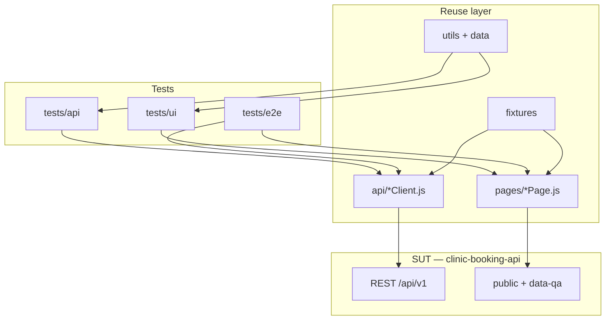

# clinic-booking-api-tests

[](https://github.com/Ariless/clinic-booking-api-tests/actions/workflows/api-tests.yml)
[](https://ariless.github.io/clinic-booking-api-tests/)

**Playwright (JavaScript)** automation for **[clinic-booking-api](https://github.com/Ariless/clinic-booking-api)** (upstream reference) — or your fork (**e.g. `clinic-booking-api-learning`**) when contracts are aligned. Controlled **SUT**: REST + demo UI under `public/`. Same engineering habits as a production-grade framework: **POM**, **API client layer**, **tagged suites**, **schema-style checks**, **no sleeps**, **`data-qa`** selectors.

**Normative design rules** (pyramid / determinism / state ownership / one-behaviour tests / failure transparency / minimalism + SRP, DRY, POM, review checklist): **`DESIGN_PRINCIPLES.md`**.

**E2E & journey scenarios (golden / negative / state machine / AI / cross-layer — no code):** **`E2E_TEST_PLAN.md`**.

**Risk-based strategy + J1/J2/J3 ownership + planned high-impact cases:** **`docs/TEST_STRATEGY.md`** (includes appointment state machine diagram, CI pipeline diagram, portfolio differentiators plan). **Impact × likelihood matrix → files:** **`docs/RISK_ANALYSIS.md`** (includes risk heatmap). **Architectural vulnerabilities, race conditions, state gaps:** **`docs/SYSTEM_WEAKNESS_REPORT.md`**.

### Why this repo exists (portfolio / interview)

- **Risk-first API checks** — what hurts users and the business (double booking, RBAC, lifecycle) before chasing coverage metrics; see **`docs/RISK_ANALYSIS.md`**.
- **Clear ownership** — J1 / J2 / J3 style files + **`@smoke`** / **`@api`** (optional **`@negative`**, **`@regression`**, **`@rbac`** in titles when you add them); see **`docs/TEST_STRATEGY.md`**.
- **What is already exercised** — auth (register + login), doctor catalog, **J1** booking slice in smoke (**pending** + `GET …/my`), **J3** confirm + slot invariant, **J2** reject, **N1** double-book `409 SLOT_TAKEN`, patient cancel + slot freed, `422 INVALID_TRANSITION`, extended RBAC (`appointments.rbac.patient`, `appointments.rbac.cross-doctor`), waitlist lifecycle + auto-promotion, rate limits (`@rate-limit`; require env override), chaos smoke + 503 body + health exempt (`@chaos`), security — IDOR + JWT tamper (`@security`; caught a real unintentional vulnerability), accessibility on login + register + booking pages (`@a11y`; axe-core, zero violations except documented color-contrast debt), UI gate + login + register forms, E2E cross-layer booking / conflict / confirm, **performance baseline** — k6 booking flow (50 VUs, p95 thresholds; `k6/booking-flow.js`), **DB-state assertions** — direct SQLite queries via `utils/dbClient.js` embedded inline in `appointments.mini.j1`, `appointments.confirm.j3`, `appointments.cancel.patient`, `appointments.waitlist`, `appointments.waitlist.promotion` — verifies `slot.isAvailable`, `appointment.status`, and waitlist row presence/absence after each operation, **mobile viewport** — `mobile-chrome` project (`Pixel 7`) re-runs all `tests/ui/**` on a 412 × 915 viewport; API tests run on `chromium` only.

### Test metrics (lightweight — for interviews, not “enterprise BI”)

We use **a few honest signals**, not dashboards for their own sake:

| Signal | How we use it |
| --- | --- |
| **Smoke gate** | `npm run test:smoke` — treat as **release-ready / demo-ready** for this repo when CI is wired; failures map to auth, catalog, critical path, or RBAC (see **`docs/RISK_ANALYSIS.md`**). |
| **Test count** | `npm run test:count` — live count of registered tests; update README snapshot after major additions. |
| **Execution time** | With SUT on localhost, smoke is typically **~1s order** wall time; full `tests/api` run **~1–3s** (machine + network dependent) — keeps feedback loop credible on interviews. |
| **Flakiness** | Target **0 flakes** — deterministic data (`nextSeedSlotWindow`, own users), no cross-test order; flakes are bugs in the suite (**`DESIGN_PRINCIPLES.md`**). |
| **”Coverage”** | **Single source:** **`docs/RISK_ANALYSIS.md`** (impact × likelihood → file / **Planned**) — update that table when tests land; avoid duplicating the matrix here. |

**Interview line:** *“I don’t optimize for line coverage first — I track which business-risk rows have a test and keep smoke fast enough to be a real gate.”*

More detail: **`docs/TEST_STRATEGY.md`** → *Metrics (portfolio)*.

### Failure detection model

How this suite knows the system broke — and what each failure means:

| Signal | What it means | Mapped to |
| --- | --- | --- |
| Smoke fails on `POST /appointments` → `201` | Core booking path is down — product unusable | `appointments.mini.j1.test.js` |
| Smoke fails on `GET /api/v1/doctors` → `200` | Catalog unreachable — patients can't pick a doctor | `doctors.list.test.js` |
| Smoke fails on `POST /auth/login` → `200` | Auth broken — no one can log in | `auth.login.test.js` |
| `409 SLOT_TAKEN` not returned on double book | Double-sale invariant broken — two patients own one slot | `appointments.booking.conflict.test.js` |
| `403` not returned on cross-role access | RBAC boundary broken — data leaks across roles | `appointments.rbac.*.test.js` |
| `422 INVALID_TRANSITION` missing | State machine accepts illegal transitions — corrupted lifecycle | `appointments.invalid-transition.test.js` |
| Cancel returns `200` but slot stays unavailable | Slot not freed — capacity lost silently | `appointments.cancel.patient.test.js` |
| Second cancel returns `200` instead of `422` | Double-cancel accepted — state machine not enforced | `appointments.concurrency.test.js` |
| Waitlist patient promoted twice after concurrent cancels | `promoteFromWaitlist` not atomic — patient double-booked | `appointments.concurrency.test.js` |
| `GET /health` returns non-`200` | DB connection lost or SUT crashed | `infrastructure.test.js` |
| `503 CHAOS_ERROR` on non-chaos run | Chaos middleware left enabled in production config | `chaos.test.js` (smoke case) |
| axe violations on login / register / booking | Accessibility regression — landmark or heading structure broken | `accessibility.test.js` (`@a11y`) |
| `GET /appointments/:id` returns `200` with no token | IDOR regression — auth guard removed from route | `security.test.js` (`@security`) |
| k6 `p(95) > 200ms` or `error_rate > 1%` threshold breached | Performance regression — latency spike or increased error rate under load | `k6/booking-flow.js` |

**Invalid states** — if any of these exist in the DB, something is broken:
- `slot.isAvailable = 0` with no active appointment referencing it
- Two appointments with `status IN ('pending','confirmed')` for the same `slotId`
- Appointment `status = 'cancelled'` but `slot.isAvailable = 0`

**Interview line:** *"I don't wait for a bug report — the suite maps each assertion to a business harm. If the double-booking test fails, I know we just sold one slot twice."*

---

## System under test

| | |
| --- | --- |
| **Repository** | Default upstream: [github.com/Ariless/clinic-booking-api](https://github.com/Ariless/clinic-booking-api). For **training / your fork** (e.g. **`clinic-booking-api-learning`**), use the same layout: set **`BASE_URL`** locally and **`SUT_GITHUB_REPOSITORY`** (`owner/repo`) in GitHub Actions so CI checks out the fork. |
| **Contracts** | `API_ENDPOINTS.md`, `CONTRACT_PACK.md`, OpenAPI (`GET /api/docs`) |
| **How to test it** | `TESTING_AGAINST_THIS_SUT.md` |
| **UI hooks** | `quality-strategy.md` → *Demo UI — stable selectors (`data-qa`)* |

Run the API locally (`npm run dev` in the SUT repo) before UI or hybrid tests. **SQLite:** see SUT notes on parallel workers vs one DB file.

---

## Tech stack

| Piece | Role |
| --- | --- |
| **Playwright** (`@playwright/test`) | UI + **built-in `request`** for API tests |
| **Node.js / JavaScript** (CommonJS) | Same style as the SUT |
| **Chromium only** | `playwright.config.js` — avoids frozen WebKit on macOS 14 arm64 |
| **dotenv** | `BASE_URL` and future secrets from `.env` (not in git) |
| **AJV** (optional, planned) | JSON validation for API bodies — align with OpenAPI fragments |
| **Allure** | Second reporting channel next to HTML + traces — **wired** (`allure-playwright` reporter, `allure-commandline`); report published to GitHub Pages on every `main` run |

---

## Architecture

### Folder layout (create paths when you add the first file — Git does not store empty dirs)

```text
clinic-booking-api-tests/
├── README.md
├── DESIGN_PRINCIPLES.md        # SRP, DRY, POM, clients, data, flakes — team norms
├── E2E_TEST_PLAN.md            # Journey & E2E scenario design (no test code)
├── docs/
│   ├── TEST_STRATEGY.md        # Risk-first scope, tags, J1/J2/J3 narrative, planned cases
│   └── RISK_ANALYSIS.md        # Impact × likelihood → existing / planned tests
├── playwright.config.js       # Chromium, testIdAttribute: data-qa, BASE_URL, CI retries
├── package.json
├── .env.example
├── .gitignore
├── config/
│   └── environments/          # Optional: baseUrl, flags per env (ci, local)
├── api/                       # API Client Layer — endpoints + auth hidden from specs
├── data/                      # Shared constants (routes, messages), optional OpenAPI snippets
├── fixtures/                  # `userFixture.js` — `user`, `loggedInPage` (same pattern as legacy UI+API framework)
├── pages/                     # Page Objects + BasePage (shared navigation / helpers)
├── utils/                     # Pure helpers (generators, parsers, requestId helpers)
└── tests/
    ├── api/                   # Contract & negative paths vs REST
    ├── ui/                    # Single-page / widget behaviour (forms, nav, guest gates)
    └── e2e/                   # Full journeys (register → book → list → cancel, doctor flow, …)
```

### Framework architecture (diagram)

How **specs**, **reuse layer**, and the **SUT** connect (no test code — structure only):



---

## System Design

### Architecture layers

| Layer | Responsibility |
| --- | --- |
| **API setup & teardown** | Register/login/delete user via `request`; seed or factory — fast, deterministic |
| **UI verification** | Only what the patient/doctor sees in `public/` |
| **Cross-layer checks** | After UI action → `GET` appointments/slots to reconcile state |
| **Test data** | Unique emails (`Date.now()` etc.), no shared mutable state between tests |

### Failure modes to simulate / assert (clinic SUT)

| Risk | Example angle | Typical layer |
| --- | --- | --- |
| Wrong transition / RBAC | `422` / `403` / `INVALID_TRANSITION` | `tests/api` |
| Double book / race | `SLOT_TAKEN`, debug route + parallel clients (SUT docs) | `tests/api` + doc |
| AI throttle / feature off | `429`, `503` `FEATURE_DISABLED` | `tests/api` |
| Guest vs auth UI | booking gate, doctor redirect | `tests/ui` |
| End-to-end trust | book → appears in “My visits” → cancel | `tests/e2e` |

---

## Business use cases

| Use case | Risk | Layers | Priority |
| --- | --- | --- | --- |
| Book only free slot | double booking, wrong patient | API + UI + optional GET verify | high |
| Doctor confirm / reject | wrong state, slot not freed | API + CONTRACT | high |
| Patient / doctor cancel rules | invalid transition | API | high |
| Waitlist on booked slot | duplicate, “still available” | API | medium |
| AI recommend | rate limit, unknown specialty | API | medium |

---

## Architecture decisions

| Decision | Rationale |
| --- | --- |
| **Playwright `request` for API tests** | Same timeouts/traces as UI runs; no extra HTTP client unless a library clearly pays off. |
| **Dedicated `api/*Client.js` layer** | SUT URLs and payloads change in one place; specs stay readable. |
| **Chromium only** | Stable local/CI runs; avoids frozen WebKit on macOS 14 arm64. |
| **`testIdAttribute: 'data-qa'`** | Matches SUT contract (`quality-strategy.md` in the API repo). |
| **No PageFactory** | Playwright locators are lazy; a thin `new Page(page)` wrapper adds little — use fixtures / `beforeEach` when small. |
| **`tests/api` · `tests/ui` · `tests/e2e`** | Clear intent: contract vs screen vs journey (same split as the previous framework). |
| **Hybrid data setup** | API for fast lifecycle; UI for user-visible behaviour; GET for reconciliation. |
| **`dotenv` for `BASE_URL`** | Environment parity local vs CI secrets. |
| **Retries + trace on first retry (CI)** | Flake investigation, not masking broken assertions — see **`DESIGN_PRINCIPLES.md`**. |

---

## Principles (carried from previous framework)

Summarised here for onboarding; **full detail and review checklist:** **`DESIGN_PRINCIPLES.md`**.

- **Page Object Model** — `pages/*Page.js`, shared **`BasePage`**.
- **No PageFactory** — instantiate pages in fixtures / `beforeEach` when still readable.
- **API client layer** — `api/*Client.js`; specs do not own raw URLs.
- **DRY / SRP** — `utils/`, `data/`, single responsibility per file type.
- **Fixtures + atomic tests** — no cross-test order dependency.
- **Tags** — `@smoke`, `@api`, `@ui`, `@e2e`; `--grep`.
- **No `sleep`**; **`data-qa`**; **flaky strategy** — retries + trace on retry, then root-cause.

---

## Setup

```bash
git clone <this-repo-url>
cd clinic-booking-api-tests
npm install
npx playwright install chromium
cp .env.example .env
# edit .env — BASE_URL must point at running SUT (default http://localhost:3000)
```

Start the SUT in the other repo (`npm run dev`). Optional: `npm run db:seed` there for known demo users.

---

## Environment

**`.env`** (gitignored), see **`.env.example`**:

```env
BASE_URL=http://localhost:3000
# add test passwords / tokens only if you avoid inline secrets in CI secrets store
```

---

## Running tests

```bash
npm test                              # all tests under tests/
npm run test:api                      # tests/api only
npm run test:ui                       # tests/ui only
npm run test:e2e                      # tests/e2e only

npx playwright test --grep @smoke
npx playwright test --grep @api
npx playwright test --grep @ui
npx playwright test --grep @e2e

npx playwright test --ui              # Playwright UI mode
```

**Performance (k6):**
```bash
# Restart SUT with rate limiter raised first:
# RATE_LIMIT_BOOKING_MAX=100000 node server.js

k6 run k6/booking-flow.js            # 50 VUs, 50s — booking flow with p95 thresholds
```

---

## CI (GitHub Actions) + Allure Report

Two workflow files under `.github/workflows/`:

### `api-tests.yml` — Playwright tests (push / PR to `main`)

Four jobs — smoke gates the rest, API and E2E run in parallel:

```
smoke  →  api   (tests/api)
       →  e2e   (tests/e2e + tests/ui)
              ↓
       allure-report  (merges all results → GitHub Pages)
```

- **SUT:** second checkout (default **`Ariless/clinic-booking-api`**). Override with repo variable **`SUT_GITHUB_REPOSITORY`** (`owner/repo`) under Settings → Actions → Variables.
- **E2E job** uses `--pass-with-no-tests` — stays green until `tests/e2e` / `tests/ui` are committed; picks them up automatically once pushed.
- **Allure** merges results from all three jobs and deploys even if a job fails (`if: always()`).

### `chaos.yml` — Chaos tests (manual: Actions → Run workflow)

Starts the SUT with `CHAOS_ENABLED=true CHAOS_FAIL_PROBABILITY=<input>`, then runs `@chaos`-tagged tests. Optional input: `fail_probability` (default `1` = every request fails).

---

**Allure Report** — updated on every `main` push:
👉 **https://ariless.github.io/clinic-booking-api-tests/**

- Pass/fail trend across runs (Allure history)
- Environment tab: Node.js version, SUT repo, Base URL
- Per-job Playwright HTML reports saved as Actions artifacts (`playwright-report-api`, `playwright-report-e2e`)

**Локально:**
```bash
npm test                    # all tests + allure-results
npm run test:smoke          # @smoke only
npm run test:api            # tests/api only
npm run test:ui             # tests/ui only
npm run test:e2e            # tests/e2e only
npm run test:chaos          # @chaos (set CHAOS_ENABLED=true + restart SUT first)
npm run report              # allure generate + open
```

**Interview line:** *”Smoke is the gate — if it fails, API and E2E don’t start. API and E2E run in parallel on separate SUT instances. Chaos is a separate manual workflow. Allure always publishes, even on failure.”*

---

## Quality & design docs in this repo

- **`DESIGN_PRINCIPLES.md`** — how we write tests and framework code (**SRP**, **DRY**, POM, clients, data, flakes, non-goals).
- **`docs/TEST_STRATEGY.md`** — risk-first strategy (API-first + **§9** UI/e2e backlog in **`E2E_TEST_PLAN.md`**), `@smoke` / `@api`, J1/J2/J3 split, planned conflict + cancel files.
- **`docs/RISK_ANALYSIS.md`** — short **impact × likelihood** table mapped to test files (and gaps).
- The SUT repo’s **`quality-strategy.md`** stays the contract for **`data-qa`** and product-side quality notes; this repo’s `docs/` stay **automation- and portfolio-facing**.

---

## Author

QA automation | Playwright | JavaScript | API + UI against a real SUT contract.
