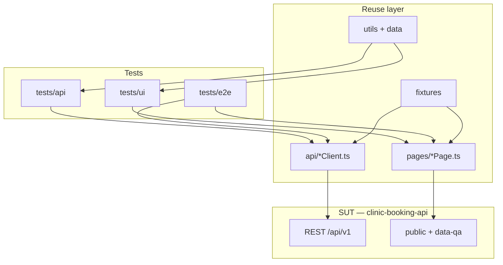

# clinic-booking-api-tests

[](https://github.com/Ariless/clinic-booking-api-tests/actions/workflows/api-tests.yml)
[](https://ariless.github.io/clinic-booking-api-tests/)

**Playwright + TypeScript** suite for a clinic booking API — API, UI and end-to-end, with the
appointment state machine, RBAC boundaries and the waitlist as the risk surface.

| | |
| --- | --- |
| **Suite** | 372 unique tests · 437 runs across projects · 83 test files |
| **Requirements** | 128 of 132 covered — `docs/RTM.md` |
| **Defect register** | **36 closed entries**, 1 open, 6 design debt — `docs/KNOWN_ISSUES.md` |
| **Live results** | [Allure report](https://ariless.github.io/clinic-booking-api-tests/), regenerated by CI on every push |
| **Stack** | Playwright · TypeScript (`strict`) · AJV · k6 · Pact · Allure · GitHub Actions |

> **The system under test is private, the test suite is the point.** You cannot run these
> tests without the SUT — so the results of a real run are published instead:
> **[live Allure report](https://ariless.github.io/clinic-booking-api-tests/)**, regenerated by CI
> on every push. What the SUT is, in one paragraph: a REST API plus a demo UI for booking
> appointments — patients book slots, doctors confirm or reject, slots free up on cancellation,
> a waitlist auto-promotes when a slot opens, and every transition is guarded by a state
> machine (`pending → confirmed → completed`, with `422 INVALID_TRANSITION` on anything else).

## Four findings worth the read

**An invariant found three defects in a feature that had six green tests.** The five invalid
states below are executed on every mutating request, not just written down. Tracing every write to
`slots.isAvailable` surfaced `B-10`, `B-11` and `B-12` — an unanswered waitlist offer that kept a
slot off sale past its TTL, a rollback that swallowed an expiry write, and an eligibility rule that
left a lapsed patient first in line. A scenario test asks whether an action returned the right
answer; an invariant asks what state it left behind. See
[Invariants as executable checks](#invariants-as-executable-checks).

**A test that had never run looked exactly like coverage.** A degradation test guarded on
`AI_SERVICE_DEGRADE`, a variable nothing set, so it skipped on every run for three months while an
integration that was never wired looked accounted for. Wiring it surfaced two more defects: two
copies of `retrieval.js` had drifted apart, and the service parsed Claude's reply with a bare
`JSON.parse` that failed every real call. `docs/KNOWN_ISSUES.md` → `TST-06`.

**Contract verification caught a field the mobile client and the API disagreed on.** Pact provider
verification against the running API surfaced an `isAvailable` serialisation mismatch (`B-15`) that
neither suite's own tests could see, because each was internally consistent.

**Recorded responses answered questions they were never asked — and that looked like a fast, green
suite.** The `@rag` layer replays recorded Anthropic responses so it can run in CI without a funded
key. The function that identifies a recorded request hashed
`JSON.stringify(body, Object.keys(body).sort())` — and that second parameter, given an array, filters
properties at *every* depth rather than sorting them, so the prompt was deleted before hashing. Every
request in the suite shared one key. Measured before the fix: **8 of 8 tests green in 2.1 seconds, 40
requests matched, 0 missed**, prompt-injection checks included, each served an answer recorded for a
different question. The same audit found `model-drift.yml` had never called a model at all — shell
variables set before `docker compose up` reach the compose process, not the container.
`docs/KNOWN_ISSUES.md` → `TST-09`, `TST-10`.

## Where to look

| If you want | Read |
| --- | --- |
| Why each test exists, and what breaks if it fails | [Failure detection model](#failure-detection-model) |
| Risk-first strategy, ownership, state machine and CI diagrams | `docs/TEST_STRATEGY.md` |
| Impact × likelihood matrix mapped to files, risk heatmap | `docs/RISK_ANALYSIS.md` |
| Architectural vulnerabilities, race conditions, state gaps | `docs/SYSTEM_WEAKNESS_REPORT.md` |
| The bug register: business impact, severity, how found, fix | `docs/KNOWN_ISSUES.md` |
| Normative design rules the suite is held to | `DESIGN_PRINCIPLES.md` |
| Requirement-to-test traceability | `docs/RTM.md` |

Tests are chosen by risk — what hurts users and the business first (double booking, RBAC, the
appointment lifecycle), rather than chasing a coverage number. Ownership follows the J1 / J2 / J3
journey split, and suites are tagged `@smoke`, `@api`, `@ui`,
`@e2e`, `@a11y`, `@rbac` so any slice can run alone. The engineering habits are the ones a
production framework is held to: page objects, an API client layer, AJV schema validation, no
sleeps, `data-qa` selectors.

<details>
<summary><b>Full coverage map</b> — every area the suite exercises today</summary>

### API layer

| Area | What it asserts | Where |
| --- | --- | --- |
| Auth, doctor catalog | register + login, catalog reachable | `auth.login.test.ts`, `doctors.list.test.ts` |
| Booking journeys | **J1** booking slice in smoke (`pending` + `GET …/my`), **J3** confirm + slot invariant, **J2** reject | `appointments.mini.j1`, `appointments.confirm.j3` |
| Double-sale guard | **N1** double-book returns `409 SLOT_TAKEN`; patient cancel frees the slot; `422 INVALID_TRANSITION` on illegal moves | `appointments.booking.conflict`, `appointments.cancel.patient` |
| RBAC | cross-role and cross-doctor access rejected | `appointments.rbac.patient`, `appointments.rbac.cross-doctor` |
| Waitlist | lifecycle plus auto-promotion when a slot opens | `appointments.waitlist`, `appointments.waitlist.promotion` |
| Notes + ratings | patient writes after the appointment; only the owner may write; response schema validated; DB confirms persistence | `appointments.notes`, `appointments.ratings` |
| Appointment type | defaults to `consultation`; `procedure` accepted; invalid type → `422 INVALID_TYPE`; a procedure needs a 60-minute slot | `appointments.type.test.ts` |
| Filtering | `status`, `doctorId`, `from`, `to`; invalid values → `400` with a descriptive error; combined filters narrow correctly | `appointments.filter.test.ts` |
| Pagination | `data`, `total`, `page`, `limit`, `totalPages` | `appointments.pagination.test.ts` |
| Doctor schedule | 10 tests: PUT/GET, within and outside hours, boundary start/end, partial overlap, no schedule, timezone offset — catches UTC comparison bugs | `doctors.schedule.test.ts` |
| DB-state assertions | direct SQLite via `utils/dbClient.ts`, inline in five suites: verifies `slot.isAvailable`, `appointment.status`, waitlist rows after each operation | `appointments.mini.j1`, `.confirm.j3`, `.cancel.patient`, `.waitlist`, `.waitlist.promotion` |

### UI layer

| Area | What it asserts | Where |
| --- | --- | --- |
| Accessibility | axe-core on login, register and booking; zero violations except documented colour-contrast debt | `accessibility.test.ts` `@a11y` |
| Guest gates | unauthenticated `/patient/consultations` and `/patient/notifications` show the sign-in gate, not the form or the feed | `guest-gates.test.ts` |
| Interaction states | booking state machine in the browser: day select enables the time picker, slot select enables submit; `page.route()` mocks so no SUT is needed — verifies wiring, not rendering | `ui-states.test.ts` |
| Disabled states | doctor select stays locked until a specialty is chosen | `ui-disabled-states.test.ts` |
| API error states | `page.route()` injects 500 and network abort on booking and cancel; error banners asserted without touching the DB | `api-error-states.test.ts` |
| Visual regression | badge state via `getComputedStyle.backgroundColor` and the `badgeByStatus()` page object method; 7 tests, 14 runs across chromium + mobile-chrome | `visual.test.ts` |
| Reschedule, recurring | patient reschedules through the form; recurring series renders the pattern set via API | `reschedule.ui.test.ts`, `appointments.recurring.ui.test.ts` |
| Pagination controls | next/prev/page select navigate; pagination survives a status filter | `doctor-appointments.pagination`, `patient-appointments.pagination` |
| Doctor schedule form | 5 tests: 7-day form renders, checkbox enables inputs, save shows success, saved schedule reloads, `OUTSIDE_WORKING_HOURS` surfaces | `doctor.schedule.ui.test.ts` |
| Mobile viewport | the `mobile-chrome` project (`Pixel 7`) re-runs all of `tests/ui/**` at 412 × 915; API tests stay on chromium only | `playwright.config.ts` |

### End-to-end

| Area | What it asserts | Where |
| --- | --- | --- |
| Doctor UI confirm | patient books via API → doctor logs in and clicks Confirm in the browser → success banner → patient sees `confirmed` via API. First test covering the doctor persona in a real browser; catches JavaScript wiring the API layer cannot see | `doctor-confirm.e2e.test.ts` |
| Patient WS notifications | WebSocket connected → doctor confirms via API → `appointment.confirmed` appears in the patient's browser in real time; proves events route to the right channel | `patient-notifications.e2e.test.ts` |
| Consultations cross-layer | booked via UI → API list confirms the record → DB consultation and payment rows verified (skip guard: `PAYMENT_MODE=mock_success`) | `consultations.cross-layer.test.ts` |
| Waitlist cross-layer | join via API → UI shows the entry → leave via UI → API confirms removal → DB confirms the row is gone | `waitlist.cross-layer.test.ts` |
| Schedule cross-layer | set through the UI, verified through API and DB | `doctor.schedule.cross-layer.test.ts` |

### Performance, infrastructure and suite hygiene

| Area | What it covers |
| --- | --- |
| Performance baseline | k6 booking flow, 50 VUs, p95 thresholds — `k6/booking-flow.js` |
| Cross-browser | smoke on BrowserStack Automate (`.github/workflows/browserstack.yml`). Finding: `safari` is not a valid Playwright project name, `webkit` is |
| TypeScript | full suite on `.ts` with `strict: true`; all 79 JS files replaced; JS and TS coexist via `allowJs`; `npx tsc --noEmit` is the zero-error bar |
| Typed enums | `AuthEndpoints`, `AppointmentErrors`, `DoctorEndpoints` per domain area — one source of truth for paths and error codes |
| Teardown on crash | `global-teardown.ts` removes `test_%@example.com` users plus linked payments, consultations, appointments and waitlist entries after a partial run, and restores slot availability |
| Dev Container | Playwright image pinned to the same version as `@playwright/test` (v1.62.1) on Node 20, matching CI; `postCreateCommand` installs dependencies and reconciles the Chromium build. Until 2026-08-21 the image sat at v1.49.1 against a 1.59.1 package while claiming to match CI exactly — it matched neither |

</details>

## Test metrics (lightweight — for interviews, not “enterprise BI”)

We use **a few honest signals**, not dashboards for their own sake:

| Signal | How we use it |
| --- | --- |
| **Smoke gate** | `npm run test:smoke` — treat as **release-ready / demo-ready** for this repo when CI is wired; failures map to auth, catalog, critical path, or RBAC (see **`docs/RISK_ANALYSIS.md`**). |
| **Test count** | `npm run test:count` — live count of registered tests; update README snapshot after major additions. |
| **Execution time** | With SUT on localhost, smoke is typically **~1s order** wall time; full `tests/api` run **~1–3s** (machine + network dependent) — keeps feedback loop credible on interviews. |
| **Flakiness** | Target **0 flakes** — deterministic data (`nextSeedSlotWindow`, own users), no cross-test order; flakes are bugs in the suite (**`DESIGN_PRINCIPLES.md`**). |
| **”Coverage”** | **Single source:** **`docs/RISK_ANALYSIS.md`** (impact × likelihood → file / **Planned**) — update that table when tests land; avoid duplicating the matrix here. |

**Interview line:** *“I don’t optimize for line coverage first — I track which business-risk rows have a test and keep smoke fast enough to be a real gate.”*

More detail: **`docs/TEST_STRATEGY.md`** → *Metrics (portfolio)*.

## Failure detection model

How this suite knows the system broke — and what each failure means:

| Signal | What it means | Mapped to |
| --- | --- | --- |
| Smoke fails on `POST /appointments` → `201` | Core booking path is down — product unusable | `appointments.mini.j1.test.ts` |
| Smoke fails on `GET /api/v1/doctors` → `200` | Catalog unreachable — patients can't pick a doctor | `doctors.list.test.ts` |
| Smoke fails on `POST /auth/login` → `200` | Auth broken — no one can log in | `auth.login.test.ts` |
| `409 SLOT_TAKEN` not returned on double book | Double-sale invariant broken — two patients own one slot | `appointments.booking.conflict.test.ts` |
| `403` not returned on cross-role access | RBAC boundary broken — data leaks across roles | `appointments.rbac.*.test.ts` |
| `422 INVALID_TRANSITION` missing | State machine accepts illegal transitions — corrupted lifecycle | `appointments.invalid-transition.test.ts` |
| Cancel returns `200` but slot stays unavailable | Slot not freed — capacity lost silently | `appointments.cancel.patient.test.ts` |
| Second cancel returns `200` instead of `422` | Double-cancel accepted — state machine not enforced | `appointments.concurrency.test.ts` |
| Waitlist patient promoted twice after concurrent cancels | `promoteFromWaitlist` not atomic — patient double-booked | `appointments.concurrency.test.ts` |
| `GET /health` returns non-`200` | DB connection lost or SUT crashed | `infrastructure.test.ts` |
| axe violations on login / register / booking | Accessibility regression — landmark or heading structure broken | `accessibility.test.ts` (`@a11y`) |
| k6 `p(95) > 200ms` or `error_rate > 1%` threshold breached | Performance regression — latency spike or increased error rate under load | `k6/booking-flow.js` |
| Doctor UI confirm button does nothing or returns error | JavaScript event handler broken or endpoint wired incorrectly — doctors can't confirm from the browser | `doctor-confirm.e2e.test.ts` |

**Interview line:** *"I don't wait for a bug report — the suite maps each assertion to a business harm. If the double-booking test fails, I know we just sold one slot twice."*

---

## Invariants as executable checks

A stated invariant and an executed one are different artifacts. This suite carries both: the states
below are written as rules, and each rule is backed either by the schema or by a runtime check that
answers on every mutating request.

**Invalid states** — if any of these exist in the DB, something is broken:

| State | Enforced by |
| --- | --- |
| Two appointments with `status IN ('pending','confirmed')` for the same `slotId` | `idx_appointments_one_active_per_slot` (partial unique index) + `INV-3` |
| Two pending offers holding the same `slotId` | `idx_offers_one_pending_per_slot` (partial unique index) + `INV-4` |
| Active appointment on a slot that is still on sale | `INV-1` |
| Live offer holding a slot that is still on sale | `INV-2` |
| A slot that is both booked and held by a live offer | `INV-5` |

**How the runtime contract works.** `src/invariants.js` in the SUT runs the five checks after every
mutating request under `ASSERT_INVARIANTS`, and answers `500 INVARIANT_VIOLATED` naming the rule that
broke. It queries the database directly and knows nothing about what the handler intended, so it
covers endpoints written after it — including paths no test targets. The two checks that duplicate an
index are kept on purpose: a dropped index stays visible instead of going quiet.

**The oracle is proven to fail.** `POST /debug/break-invariant` desyncs state on purpose and
`tests/api/invariants.test.ts` asserts the 500 — an oracle nobody has watched fail is
indistinguishable from one that never fires. Measured on the day it shipped: 159 API tests with the
contract on, **zero** false positives, and the only firings came from the deliberate break.

**Invariants are verified against the code before they ship.** Two further candidates were dropped at
that step: "a waitlisted patient has no active booking with that doctor" is false by design, because
declining an offer keeps the patient in the queue while their booking stays live. A check that fires
on correct behaviour is worse than no check.

**What this method found.** Tracing every write to `slots.isAvailable` against `INV-1`/`INV-2`
surfaced three defects in a feature with six passing scenario tests — the difference is what each
kind of test asks. A scenario test asks "did this action return the right answer"; an invariant asks
"what state did it leave behind":

| ID | Defect | Fix |
| --- | --- | --- |
| B-10 | A waitlist offer held a slot until accepted or declined; an offer left unanswered kept the slot off sale after its TTL passed. | `expireStaleOffers()` sweep + `AUTO_EXPIRE_OFFERS_INTERVAL_MS` timer; expiry releases the slot and advances the queue. |
| B-11 | The expiry write in `acceptOffer` ran inside `db.transaction()` and the 410 was thrown from the same block; better-sqlite3 rolls back on throw, so the row kept its previous status. | Expiry returns a marker, the throw moved outside the transaction, so the state change commits. |
| B-12 | The eligibility rule covered `declined`; an offer that lapsed left the patient first in line for the same slot. | `expired` added alongside `declined` in `getNextWaitlistEntry`, shipped together with the sweep. |

**Where the schema stops.** `isAvailable = 0` with no booking and no live offer is not flagged: the
column carries both "the doctor closed this slot" and "something holds this slot", and the two are
indistinguishable after the fact. Splitting it into stored intent and derived occupancy is costed and
argued in `sut/DESIGN_PROPOSALS.md` §1, and deliberately deferred — this SUT exists to be a test
target, and a hand-maintained denormalised flag is one of its more productive bug generators.

**Interview line:** *"A written invariant and an executed one are different artifacts. I turned ours
into queries the system runs on every write — and the first one found three defects in a feature that
had six green tests."*

---

## System under test

| | |
| --- | --- |
| **Repository** | `github.com/Ariless/clinic-booking-api` — private, as noted above. Set `BASE_URL` locally; set `SUT_GITHUB_REPOSITORY` (`owner/repo`) in GitHub Actions so CI checks out the SUT. |
| **Contracts** | `API_ENDPOINTS.md`, `CONTRACT_PACK.md`, OpenAPI (`GET /api/docs`) |
| **How to test it** | `TESTING_AGAINST_THIS_SUT.md` |
| **UI hooks** | `quality-strategy.md` → *Demo UI — stable selectors (`data-qa`)* |

Run the API locally (`npm run dev` in the SUT repo) before UI or hybrid tests. **SQLite:** see SUT notes on parallel workers vs one DB file.

---

## Tech stack

| Piece | Role |
| --- | --- |
| **Playwright** (`@playwright/test`) | UI + **built-in `request`** for API tests |
| **Node.js / TypeScript** | `strict: true`; gradual migration from JS — all new files in TS |
| **Chromium + mobile-chrome** | `playwright.config.ts` — Pixel 7 viewport re-runs all UI tests; avoids frozen WebKit on macOS 14 arm64 |
| **dotenv** | `BASE_URL` and secrets from `.env` (not in git) |
| **AJV** | JSON schema validation — wired; schemas in `data/schemas/` |
| **better-sqlite3** | Direct DB assertions in E2E tests via `utils/dbClient.ts` |
| **Allure** | Second reporting channel next to HTML + traces — wired (`allure-playwright` reporter); report published to GitHub Pages on every `main` run |
| **k6** | Performance gate — 50 VUs booking flow; p95 + error rate thresholds (`k6/booking-flow.js`) |
| **BrowserStack** | Cross-browser CI workflow (`.github/workflows/browserstack.yml`) |
| **fast-check** | Property-based tests — schedule boundary arbitraries |
| **Stryker** | Mutation testing — validates test suite sensitivity |

---

## Architecture

### Folder layout (create paths when you add the first file — Git does not store empty dirs)

```text
clinic-booking-api-tests/
├── README.md
├── DESIGN_PRINCIPLES.md        # SRP, DRY, POM, clients, data, flakes — team norms
├── BACKLOG.md                  # Working backlog — features, tests, career actions
├── docs/
│   ├── TEST_STRATEGY.md        # Risk-first scope, tags, J1/J2/J3 narrative, planned cases
│   ├── RISK_ANALYSIS.md        # Impact × likelihood → existing / planned tests
│   ├── KNOWN_ISSUES.md         # Defect register — product defects and suite defects, kept apart
│   ├── SYSTEM_WEAKNESS_REPORT.md  # Weaknesses by subsystem, including the ones left open on purpose
│   ├── OWASP_AGENTIC.md        # ASI01-ASI10 mapped to what this system can actually have
│   └── FACTS.json              # Countable claims, verified by scripts/check-conventions.js
├── playwright.config.ts       # Chromium + mobile-chrome, testIdAttribute: data-qa, BASE_URL, CI retries
├── global-teardown.ts         # Removes orphaned test users + linked data after crash
├── package.json
├── .env.example
├── .gitignore
├── config/
│   ├── env.ts                 # BASE_URL from process.env
│   ├── models.json            # Model ids — one place, three roles (subject / judge / tooling)
│   └── models.ts              # …and why each role exists; read this before changing a value
├── api/                       # API Client Layer — one TS class per resource
├── data/                      # testData.ts (endpoints), seedAccounts.ts, schemas/
├── fixtures/                  # Playwright fixtures — user, slot, twoUsers
│   └── cassettes/             # Recorded Anthropic responses, replayed over HTTP by the proxy
├── flows/                     # Multi-step API sequences reused across tests
├── pages/                     # Page Objects + BasePage (TS)
├── enums/                     # Typed constants per domain area (auth, appointments, doctors, ai, consultations)
├── utils/                     # dbClient, schemaValidator, slotAssertion, webhookTestServer, userUtils,
│                              # phi (redaction), claudeCassette + claudeReplayProxy, retrievalMetrics
└── tests/
    ├── api/                   # Contract & negative paths vs REST (+ concurrency/)
    ├── ui/                    # Single-page / widget behaviour (forms, nav, guest gates, error states)
    ├── e2e/                   # Full journeys (register → book → list → cancel, doctor flow, …)
    └── unit/                  # Offline checks needing no SUT: retrieval metrics, cassette keys,
                               # model config, PHI redaction, knowledge-corpus integrity
```

### Framework architecture (diagram)

How **specs**, **reuse layer**, and the **SUT** connect (no test code — structure only):


```mermaid
flowchart TB
  subgraph T [Tests]
    A["tests/api"]
    U["tests/ui"]
    E["tests/e2e"]
  end
  subgraph F [Reuse layer]
    C["api/*Client.ts"]
    P["pages/*Page.ts"]
    X["fixtures"]
    M["utils + data"]
  end
  subgraph S [SUT — clinic-booking-api]
    R["REST /api/v1"]
    H["public + data-qa"]
  end
  A --> C
  U --> P
  E --> C
  E --> P
  X --> C
  X --> P
  M --> A
  M --> U
  C --> R
  P --> H
```

---

## System Design

### Architecture layers

| Layer | Responsibility |
| --- | --- |
| **API setup & teardown** | Register/login/delete user via `request`; seed or factory — fast, deterministic |
| **UI verification** | Only what the patient/doctor sees in `public/` |
| **Cross-layer checks** | After UI action → `GET` appointments/slots to reconcile state |
| **Test data** | Unique emails (`Date.now()` etc.), no shared mutable state between tests |

### Failure modes to simulate / assert (clinic SUT)

| Risk | Example angle | Typical layer |
| --- | --- | --- |
| Wrong transition / RBAC | `422` / `403` / `INVALID_TRANSITION` | `tests/api` |
| Double book / race | `SLOT_TAKEN`, debug route + parallel clients (SUT docs) | `tests/api` + doc |
| AI throttle / feature off | `429`, `503` `FEATURE_DISABLED` | `tests/api` |
| Guest vs auth UI | booking gate, doctor redirect | `tests/ui` |
| End-to-end trust | book → appears in “My visits” → cancel | `tests/e2e` |

---

## Business use cases

| Use case | Risk | Layers | Priority |
| --- | --- | --- | --- |
| Book only free slot | double booking, wrong patient | API + UI + optional GET verify | high |
| Doctor confirm / reject | wrong state, slot not freed | API + CONTRACT | high |
| Patient / doctor cancel rules | invalid transition | API | high |
| Waitlist on booked slot | duplicate, “still available” | API | medium |
| AI recommend | rate limit, unknown specialty | API | medium |

---

## Architecture decisions

| Decision | Rationale |
| --- | --- |
| **Playwright `request` for API tests** | Same timeouts/traces as UI runs; no extra HTTP client unless a library clearly pays off. |
| **Dedicated `api/*Client.ts` layer** | SUT URLs and payloads change in one place; specs stay readable. |
| **Chromium + mobile-chrome** | Stable local/CI runs; Pixel 7 viewport re-runs all UI tests; avoids frozen WebKit on macOS 14 arm64. |
| **`testIdAttribute: 'data-qa'`** | Matches SUT contract (`quality-strategy.md` in the API repo). |
| **Page objects via fixture injection** | Playwright locators are lazy, so page objects stay thin wrappers; all 7 are wired in `fixtures/pages.ts` via `base.extend()` and specs destructure what they need. No `new XPage(page)` in test files. |
| **`tests/api` · `tests/ui` · `tests/e2e`** | Clear intent: contract vs screen vs journey (same split as the previous framework). |
| **Hybrid data setup** | API for fast lifecycle; UI for user-visible behaviour; GET for reconciliation. |
| **`dotenv` for `BASE_URL`** | Environment parity local vs CI secrets. |
| **Retries + trace on first retry (CI)** | Flake investigation, not masking broken assertions — see **`DESIGN_PRINCIPLES.md`**. |
| **Invariant-based assertions** | Tests prove system properties, not just status codes — e.g. cancel must free the slot atomically, promotion must happen exactly once. DB checks in E2E tests confirm persistence, not just the HTTP response. |
| **FMEA-inspired weakness analysis** | `docs/SYSTEM_WEAKNESS_REPORT.md` maps each architectural failure mode to severity + test coverage before writing a single test — same structured thinking as Failure Mode and Effects Analysis. |
| **Observability instrumentation assertions** | Every error response is asserted to include `requestId` — the field that correlates a user-visible error to a specific log line in production. Planned: `GET /metrics` counter assertions after state-changing operations (booking, cancel, waitlist join). |

---

## Principles (carried from previous framework)

Summarised here for onboarding; **full detail and review checklist:** **`DESIGN_PRINCIPLES.md`**.

- **Page Object Model** — `pages/*Page.ts`, shared **`BasePage`**.
- **No PageFactory** — page objects are instantiated once in `fixtures/pages.ts`; specs destructure them, never call `new`.
- **API client layer** — `api/*Client.ts`; specs do not own raw URLs.
- **DRY / SRP** — `utils/`, `data/`, single responsibility per file type.
- **Fixtures + atomic tests** — no cross-test order dependency.
- **Tags** — `@smoke`, `@api`, `@ui`, `@e2e`; `--grep`.
- **No `sleep`**; **`data-qa`**; **flaky strategy** — retries + trace on retry, then root-cause.

---

## Setup

```bash
git clone <this-repo-url>
cd clinic-booking-api-tests
npm install
npx playwright install chromium
cp .env.example .env
# edit .env — BASE_URL must point at running SUT (default http://localhost:3000)
```

**Option A — Docker (recommended, matches CI exactly):**

```bash
cd ../sut
mkdir -p data
docker compose -f docker-compose.test.yml up -d --wait
```

**Option B — bare Node:**

```bash
cd ../sut
npm run dev   # or: npm run db:seed && npm start
```

---

## Environment

**`.env`** (gitignored), see **`.env.example`**:

```env
BASE_URL=http://localhost:3000
# add test passwords / tokens only if you avoid inline secrets in CI secrets store
```

---

## Running tests

```bash
npm test                              # all tests under tests/
npm run test:api                      # tests/api only
npm run test:ui                       # tests/ui only
npm run test:e2e                      # tests/e2e only
npm run test:invariants               # runtime invariant contract (see below)

npx playwright test --grep @smoke
npx playwright test --grep @api
npx playwright test --grep @ui
npx playwright test --grep @e2e

npx playwright test --ui              # Playwright UI mode
```

**Runtime invariant contract** — needs a SUT started with the oracle on:

```bash
cd ../sut
NODE_ENV=development ENABLE_DEBUG_ROUTES=true ASSERT_INVARIANTS=true npm run dev

cd ../clinic-booking-api-tests
npm run test:invariants
```

Without those flags the invariant tests **skip** rather than fail: a suite that goes red because of
how the SUT was launched trains people to ignore red. Same rule as the Kafka and rate-limit tests.

**Performance (k6):**
```bash
# Restart SUT with rate limiter raised first:
# RATE_LIMIT_BOOKING_MAX=100000 node server.js

k6 run k6/booking-flow.js            # 50 VUs, 50s — booking flow with p95 thresholds
```

---

## CI (GitHub Actions) + Allure Report

Nine workflow files under `.github/workflows/`. One runs on every push; the rest are scheduled or
manual, because they need a funded key, a device cloud, or twenty minutes.

### `api-tests.yml` — Playwright tests (push / PR to `main`)

Smoke gates the rest; the layers below run in parallel:

```
smoke  →  api         (tests/api)
       →  e2e         (tests/e2e + tests/ui)
       →  invariants  (tests/api against a SUT with ASSERT_INVARIANTS on)
       →  ai-service  (tests/api against a SUT delegating to the standalone ai-service)
       →  rag-replay  (@rag against recorded Anthropic responses — no key, no network)
              ↓
       allure-report  (merges api + e2e + smoke results → GitHub Pages)
```

### The other eight

| Workflow | Trigger | What it is for |
|---|---|---|
| `security-scan.yml` | manual | Two OWASP lists: a ZAP baseline for the web Top 10, and an `agentic` job for the Top 10 for Agentic Applications — see `docs/OWASP_AGENTIC.md` |
| `model-drift.yml` | weekly + manual | The `@rag` golden dataset against the **live** API, to catch the model's behaviour moving under a fixed id. Takes an optional model input, so the suite can be swept against a different model |
| `chaos.yml` | manual | The SUT with `CHAOS_ENABLED` — deterministic fault injection by seed |
| `rate-limit.yml` | manual | Limiter contract, isolated because it needs the SUT restarted with different limits |
| `performance.yml` | manual | k6 saturation run |
| `browserstack.yml` | manual | Cross-browser on real devices |
| `impact-analysis.yml` | PR | Claude reads the diff and reports which tests the change touches |
| `update-visual-snapshots.yml` | manual | Regenerates Linux baselines for the visual suite |

- **SUT:** checked out from **`Ariless/clinic-booking-api`** (override: repo variable **`SUT_GITHUB_REPOSITORY`** under Settings → Actions → Variables), then started via `docker compose -f sut/docker-compose.test.yml up -d --wait` — same image as local, healthcheck-gated startup, `docker compose down` on cleanup.
- **E2E job** uses `--pass-with-no-tests` — stays green until `tests/e2e` / `tests/ui` are committed; picks them up automatically once pushed.
- **Delegated AI job** starts the SUT with the `docker-compose.ai-service.yml` overlay, so the specialty decision travels over HTTP to the standalone service instead of happening in-process. Three things run there: Pact provider verification against the service actually running in that job, the whole API layer over the delegated topology, and a deliberate outage — the service is stopped and the SUT must answer `503 AI_SERVICE_UNAVAILABLE` rather than blame the model. The job exists because the alternative was three months of an integration recorded as done, never wired, and guarded by a test that skipped on every run.
- **RAG replay job** runs the `@rag` layer against recorded Anthropic responses, served by a proxy the suite starts itself, so the layer that exercises the real recommendation path no longer sits out CI waiting for a funded key. Mock mode cannot substitute: it answers from retrieval and never calls a model, so it exercises none of what these tests are about. What replay does *not* cover is model drift — a recording is frozen by definition, and that is `model-drift.yml`'s job. Gating since 2026-08-27: the cassettes written under `TST-09` were unsalvageable and were re-recorded in one `npm run rag:record` — 40 responses across 29 files, replayed as `matched 40 · recorded 0 · missed 0` in 3.5 s with no key anywhere in the job.
- **Invariants job** starts the SUT with an overlay (`docker-compose.test.yml` + `docker-compose.invariants.yml`) that sets `ASSERT_INVARIANTS=true` and `NODE_ENV=development`, then runs the API layer against it. Two things have to hold: the oracle answers `500 INVARIANT_VIOLATED` on a deliberate breach, and the SUT logs no violation on any other path. It is `continue-on-error` until a week of runs is clean — gating merges on two days of local evidence would be premature, and leaving the flag in forever would make the job decorative.
- **Allure** merges results from smoke, api and e2e and deploys even if a job fails (`if: always()`). The invariants job re-runs the same API suite under a different SUT configuration, so its results stay a separate artifact (`allure-results-invariants`) instead of doubling every test in the report.

---

**Allure Report** — updated on every `main` push:
👉 **https://ariless.github.io/clinic-booking-api-tests/**

- Pass/fail trend across runs (Allure history)
- Environment tab: Node.js version, SUT repo, Base URL
- Per-job Playwright HTML reports saved as Actions artifacts (`playwright-report-api`, `playwright-report-e2e`)

**Локально:**
```bash
npm test                    # all tests + allure-results
npm run test:smoke          # @smoke only
npm run test:api            # tests/api only
npm run test:ui             # tests/ui only
npm run test:e2e            # tests/e2e only
npm run report              # allure generate + open
```

**AI tooling scripts:**
```bash
npm run mcp:track           # launch browser with CDP + coverage tracker; Ctrl+C saves coverage/mcp-session-*.json
npm run ci:impact           # Claude reads git diff → identifies which tests to run
npm run ai:gap-analysis     # Claude reads test suite → reports untested endpoints
npm run ai:flakiness        # Claude classifies flaky test root causes from bug-reports/
npm run ai:test-gen         # Claude generates test stubs from openapi.yaml
```

**Interview line:** *”Smoke is the gate — if it fails, API and E2E don’t start. The SUT runs as a Docker container in every CI job: same image as local, no curl loop, no orphan processes. API and E2E run in parallel. Chaos is a separate manual workflow. Allure always publishes, even on failure.”*

---

## Quality & design docs in this repo

- **`DESIGN_PRINCIPLES.md`** — how we write tests and framework code (**SRP**, **DRY**, POM, clients, data, flakes, non-goals).
- **`docs/TEST_STRATEGY.md`** — risk-first strategy, `@smoke` / `@api`, J1/J2/J3 split, CI pipeline, portfolio differentiators.
- **`docs/RISK_ANALYSIS.md`** — short **impact × likelihood** table mapped to test files (and gaps).
- **`docs/KNOWN_ISSUES.md`** — bug register: **30 closed entries** — product bugs (IDOR, a11y, WS `ClinicCore`, banner timing, reschedule 409 with an active waitlist, the three waitlist-offer defects the invariant contract surfaced), CI and environment issues (route pattern, private repo auth, SQLite readonly in Docker, teardown cascades) suite defects (`TST-01…TST-06`, the last two a convention check that read the fixture barrel by its wording and a degradation test gated on a variable nothing set) and the `isAvailable` serialisation mismatch the mobile pact verification caught (B-15); **1 open bug** (procedure booked into a slot shorter than its required duration); **3 design debt items** + 1 dead code finding (unreachable `INVALID_PATTERN` errorCode); each entry with business impact, severity, how found, fix applied.
- **`docs/TEST_SUMMARY_STAKEHOLDER.md`** — one-page non-technical summary for PM/stakeholder: traffic-light status per area, bugs in plain English, open issues with options, release recommendation.
- **`docs/GO_NO_GO.md`** — release recommendation for the 2026-04-28 → 2026-05-12 cycle, kept as a dated snapshot rather than rewritten: Conditional Go; 4 bugs fixed in that cycle; 3 open issues (retrieval ranking, empty doctors, procedure slot duration); post-release monitoring signals.
- **`docs/RTM.md`** — requirements traceability matrix: 121 requirements across 16 areas mapped to test files; 117 covered (97%), 1 partial, 3 gaps documented with explicit reasons.
- **`docs/BUSINESS_RULES.md`** — all domain rules in one place (accounts, state machine, slots, waitlist, RBAC, AI, payments, error contract); each rule numbered and testable; gap list of rules without test coverage.
- **`docs/ACCEPTANCE_CRITERIA.md`** — "feature is done when..." for all 21 features; written as shift-left artifact; gap table of criteria not yet covered by automated tests.
- The SUT repo’s **`quality-strategy.md`** stays the contract for **`data-qa`** and product-side quality notes; this repo’s `docs/` stay **automation- and portfolio-facing**.

---

---

## SUT extensions (added for testability and portfolio)

These features were added to the SUT to enable meaningful UI/E2E coverage and to demonstrate end-to-end thinking:

| Extension | What it does | Why it was added |
| --- | --- | --- |
| `patient-consultations.html` + `/patient/consultations` route | Form to book a consultation (doctor select + payment method) + consultation history | The payment feature had API coverage but zero UI. No UI = nothing to test at the E2E layer. |
| `patient-notifications.html` + `/patient/notifications` route | Live WebSocket notification feed for the patient | Demonstrates WebSocket is real: patients see `appointment.confirmed`, `.rejected`, `.cancelled_by_doctor` in the browser in real time. |
| Patient-side WebSocket (`wsServer`, `wsNotifier`, `connections`) | Server now accepts WS connections from patients, not just doctors | Existing WS was doctor-only. Adding patient delivery is a real business feature — patients know instantly when their appointment status changes. |
| Nav links updated on all patient pages | Consultations + Notifications accessible from any patient page | Consistency; also needed so Playwright can navigate without hardcoding URLs everywhere. |

---

## Risk-based decisions (interview / defence notes)

### What was removed and why

| Removed | Reason |
| --- | --- |
| `doctors.list.test.ts` — "idempotent, repeated call returns same data" | Tested REST contract semantics (GET idempotency), not a business risk specific to this system. Adds test count without adding confidence in anything that could actually fail. |
| `security.test.ts` — `POST /api/v1/appointments — 401 with no auth token` | Duplicate of the GET 401 test above it. Both verify the same auth middleware is applied. One test proves the middleware is wired; a second on a different verb adds marginal confidence that doesn't justify the maintenance cost. |

### Why UI tests only cover error paths

All business logic is exercised at the API layer (fast, deterministic, no browser overhead). UI tests cover only what the API cannot verify: error message rendering, form validation display, guest gates, accessibility. Successful login and successful registration are covered by `auth.login.test.ts` and `auth.register.test.ts` at API level — adding UI duplicates of the same happy paths would be testing the framework, not the product.

**Interview line:** *"I test at the lowest layer that gives me confidence. Business logic belongs in API tests. UI tests catch rendering and wiring bugs — things only a browser can see."*

### Why the doctor UI E2E test was added

`confirm.cross-layer.test.ts` already calls `confirmAppointment()` via the API client. That test proves the HTTP endpoint works. It does not prove the doctor's browser can confirm appointments — a broken `addEventListener`, a wrong `data-appt-id`, or a missing `window.confirm` handler would all pass the API test and fail in the real UI. `doctor-confirm.e2e.test.ts` fills that gap and is the only test where the doctor persona interacts with a real browser.

---

## Author

QA automation | Playwright | TypeScript | API + UI + E2E against a real SUT contract.
