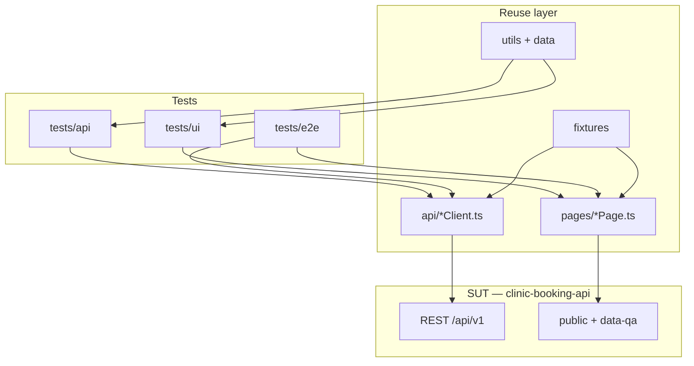

# clinic-booking-api-tests


<!-- private-refs-notice -->
> **Referenced but not in this repository:** premium tests and workflows (`security.test.ts`); SUT-side files (`API_ENDPOINTS.md`, `CONTRACT_PACK.md`, `TESTING_AGAINST_THIS_SUT.md`, `quality-strategy.md`). These live in the private repos — see *Premium content* in `README.md`.

[](https://github.com/Ariless/clinic-booking-api-tests/actions/workflows/api-tests.yml)
[](https://ariless.github.io/clinic-booking-api-tests/)

**Playwright (TypeScript)** automation for **[clinic-booking-api](https://github.com/Ariless/clinic-booking-api)**. Controlled **SUT**: REST + demo UI under `public/`. Same engineering habits as a production-grade framework: **POM**, **API client layer**, **tagged suites**, **AJV schema validation**, **no sleeps**, **`data-qa`** selectors.

**Normative design rules** (pyramid / determinism / state ownership / one-behaviour tests / failure transparency / minimalism + SRP, DRY, POM, review checklist): **`DESIGN_PRINCIPLES.md`**.


**Risk-based strategy + J1/J2/J3 ownership + planned high-impact cases:** **`docs/TEST_STRATEGY.md`** (includes appointment state machine diagram, CI pipeline diagram, portfolio differentiators plan). **Impact × likelihood matrix → files:** **`docs/RISK_ANALYSIS.md`** (includes risk heatmap). **Architectural vulnerabilities, race conditions, state gaps:** **`docs/SYSTEM_WEAKNESS_REPORT.md`**.

> **Premium content** — AI testing patterns (metamorphic, adversarial, RAG, LLM judge), security (IDOR, BOLA), chaos, rate-limit, Pact contracts, Claude agent infrastructure (`.claude/skills/`, `CLAUDE.md`) and task solutions live in a **private repo**. Available on request during interviews or via [QA Portfolio Lab](https://gumroad.com).

### Why this repo exists (portfolio / interview)

- **Risk-first API checks** — what hurts users and the business (double booking, RBAC, lifecycle) before chasing coverage metrics; see **`docs/RISK_ANALYSIS.md`**.
- **Clear ownership** — J1 / J2 / J3 style files + **`@smoke`** / **`@api`** (optional **`@negative`**, **`@regression`**, **`@rbac`** in titles when you add them); see **`docs/TEST_STRATEGY.md`**.
- **What is already exercised** — auth (register + login), doctor catalog, **J1** booking slice in smoke (**pending** + `GET …/my`), **J3** confirm + slot invariant, **J2** reject, **N1** double-book `409 SLOT_TAKEN`, patient cancel + slot freed, `422 INVALID_TRANSITION`, extended RBAC (`appointments.rbac.patient`, `appointments.rbac.cross-doctor`), waitlist lifecycle + auto-promotion, accessibility on login + register + booking pages (`@a11y`; axe-core, zero violations except documented color-contrast debt), UI gate + login + register forms, E2E cross-layer booking / conflict / confirm, **doctor UI confirm** (`doctor-confirm.e2e.test.ts` `@e2e`) — patient books via API → doctor logs in, clicks Confirm in the doctor UI → success banner → patient sees confirmed via API; first test covering the doctor persona in a real browser; catches JavaScript wiring errors the API layer cannot see, **performance baseline** — k6 booking flow (50 VUs, p95 thresholds; `k6/booking-flow.js`), **DB-state assertions** — direct SQLite queries via `utils/dbClient.ts` embedded inline in `appointments.mini.j1`, `appointments.confirm.j3`, `appointments.cancel.patient`, `appointments.waitlist`, `appointments.waitlist.promotion` — verifies `slot.isAvailable`, `appointment.status`, and waitlist row presence/absence after each operation, **mobile viewport** — `mobile-chrome` project (`Pixel 7`) re-runs all `tests/ui/**` on a 412 × 915 viewport; API tests run on `chromium` only, **patient WS notifications** (`patient-notifications.e2e.test.ts` `@e2e`) — WebSocket connected → doctor confirms via API → `appointment.confirmed` notification item appears in patient browser in real time; proves server correctly routes events to the patient channel, **consultations cross-layer** (`consultations.cross-layer.test.ts` `@e2e`) — patient books consultation via UI → API list confirms record → DB consultation row + payment row verified; skip guard: `PAYMENT_MODE=mock_success`, **waitlist cross-layer** (`waitlist.cross-layer.test.ts` `@e2e`) — join via API → UI shows waitlist entry → leave via UI → API verifies removal → DB confirms row deleted, **guest gate — consultations** (`guest-gates.test.ts` `@ui`) — unauthenticated user reaches `/patient/consultations` and sees sign-in gate instead of the booking form, **guest gate — notifications** (`guest-gates.test.ts` `@ui`) — unauthenticated user reaches `/patient/notifications` and sees sign-in gate instead of the live feed, **TypeScript migration** — full suite migrated to `.ts` (`strict: true`); all 79 JS files replaced; JS and TS coexist via `allowJs: true`; `npx tsc --noEmit` is the zero-errors bar, **doctor schedule / working hours** (`doctors.schedule.test.ts` `@api`, `doctor.schedule.ui.test.ts` `@ui`, `doctor.schedule.cross-layer.test.ts` `@e2e`) — 10 API tests (PUT/GET schedule, within/outside hours, boundary start/end, partial overlap, no schedule, timezone offset), 5 UI tests (7-day form renders, checkbox enables inputs, save shows success, saved schedule loads into form, OUTSIDE_WORKING_HOURS shown in slot form), 1 E2E: set via UI → verified via API + DB; catches UTC comparison bugs the API layer alone can't surface, **global teardown on crash** (`global-teardown.ts`) — removes `test_%@example.com` users + linked payments, consultations, appointments, waitlist entries after a partial run; restores slot availability; wired via `globalTeardown` in `playwright.config.ts`, **visual regression** (`visual.test.ts` `@ui`) — badge state assertions via `getComputedStyle.backgroundColor`; `badgeByStatus()` page object method; 10 tests across chromium + mobile-chrome, **API error states** (`api-error-states.test.ts` `@ui`) — 3 tests using `page.route()` to inject 500 and network abort; booking 500, cancel 500, network abort; verifies error banners without touching the DB, **appointment notes + ratings** (`appointments.notes.test.ts`, `appointments.ratings.test.ts` `@api`) — patient adds note and rating after appointment; RBAC: only appointment owner can write; schema validation on response; DB assertion confirms persistence, **appointment type field** (`appointments.type.test.ts` `@api`) — `POST /appointments` defaults to `consultation`; explicit `type=procedure` accepted; invalid type rejected with `422 INVALID_TYPE`; procedure slot requires 60-min minimum duration, **appointment filter** (`appointments.filter.test.ts` `@api`) — `GET …/my` accepts `status`, `doctorId`, `from`, `to` query params; invalid values return `400` with descriptive error; combined filters narrow result set correctly, **appointment list pagination** (`appointments.pagination.test.ts` `@api`, pagination UI in `doctor-appointments.pagination.test.ts` + `patient-appointments.pagination.test.ts` `@ui`) — paginated list returns `data`, `total`, `page`, `limit`, `totalPages`; UI controls (next/prev/page select) navigate pages; pagination persists through status filter, **BrowserStack cross-browser** (`.github/workflows/browserstack.yml`) — smoke suite runs on remote browsers via BrowserStack Automate; key finding: `safari` is not a valid Playwright project name — use `webkit` instead, **UI interaction states** (`ui-states.test.ts` `@ui`) — booking flow state machine in the browser: day select enables time picker, slot select enables submit; `page.route()` mocks to avoid SUT dependency; verifies wiring not just rendering, **UI disabled states** (`ui-disabled-states.test.ts` `@ui`) — form controls disabled until prerequisites met: doctor select locked until specialty chosen; confirms conditional enable/disable logic is wired correctly, **appointment reschedule UI** (`reschedule.ui.test.ts` `@ui`) — patient reschedules via UI; new slot selected → confirmed in API response; covers the reschedule form flow end-to-end, **recurring appointments UI** (`appointments.recurring.ui.test.ts` `@ui`) — recurring series shown correctly in patient view; UI reflects recurrence pattern set via API, **typed enums** (`enums/` per domain area) — `AuthEndpoints`, `AppointmentErrors`, `DoctorEndpoints` etc. as typed TS constants; single source of truth for endpoint paths and error codes across the test suite, **Dev Container** (`.devcontainer/devcontainer.json`) — Playwright v1.49.1 image with Node + browsers; `postCreateCommand: npm install`; `BASE_URL` points to `host.docker.internal:3000`; matches CI environment exactly.

### Test metrics (lightweight — for interviews, not “enterprise BI”)

We use **a few honest signals**, not dashboards for their own sake:

| Signal | How we use it |
| --- | --- |
| **Smoke gate** | `npm run test:smoke` — treat as **release-ready / demo-ready** for this repo when CI is wired; failures map to auth, catalog, critical path, or RBAC (see **`docs/RISK_ANALYSIS.md`**). |
| **Test count** | `npm run test:count` — live count of registered tests; update README snapshot after major additions. |
| **Execution time** | With SUT on localhost, smoke is typically **~1s order** wall time; full `tests/api` run **~1–3s** (machine + network dependent) — keeps feedback loop credible on interviews. |
| **Flakiness** | Target **0 flakes** — deterministic data (`nextSeedSlotWindow`, own users), no cross-test order; flakes are bugs in the suite (**`DESIGN_PRINCIPLES.md`**). |
| **”Coverage”** | **Single source:** **`docs/RISK_ANALYSIS.md`** (impact × likelihood → file / **Planned**) — update that table when tests land; avoid duplicating the matrix here. |

**Interview line:** *“I don’t optimize for line coverage first — I track which business-risk rows have a test and keep smoke fast enough to be a real gate.”*

More detail: **`docs/TEST_STRATEGY.md`** → *Metrics (portfolio)*.

### Failure detection model

How this suite knows the system broke — and what each failure means:

| Signal | What it means | Mapped to |
| --- | --- | --- |
| Smoke fails on `POST /appointments` → `201` | Core booking path is down — product unusable | `appointments.mini.j1.test.ts` |
| Smoke fails on `GET /api/v1/doctors` → `200` | Catalog unreachable — patients can't pick a doctor | `doctors.list.test.ts` |
| Smoke fails on `POST /auth/login` → `200` | Auth broken — no one can log in | `auth.login.test.ts` |
| `409 SLOT_TAKEN` not returned on double book | Double-sale invariant broken — two patients own one slot | `appointments.booking.conflict.test.ts` |
| `403` not returned on cross-role access | RBAC boundary broken — data leaks across roles | `appointments.rbac.*.test.ts` |
| `422 INVALID_TRANSITION` missing | State machine accepts illegal transitions — corrupted lifecycle | `appointments.invalid-transition.test.ts` |
| Cancel returns `200` but slot stays unavailable | Slot not freed — capacity lost silently | `appointments.cancel.patient.test.ts` |
| Second cancel returns `200` instead of `422` | Double-cancel accepted — state machine not enforced | `appointments.concurrency.test.ts` |
| Waitlist patient promoted twice after concurrent cancels | `promoteFromWaitlist` not atomic — patient double-booked | `appointments.concurrency.test.ts` |
| `GET /health` returns non-`200` | DB connection lost or SUT crashed | `infrastructure.test.ts` |
| axe violations on login / register / booking | Accessibility regression — landmark or heading structure broken | `accessibility.test.ts` (`@a11y`) |
| k6 `p(95) > 200ms` or `error_rate > 1%` threshold breached | Performance regression — latency spike or increased error rate under load | `k6/booking-flow.js` |
| Doctor UI confirm button does nothing or returns error | JavaScript event handler broken or endpoint wired incorrectly — doctors can't confirm from the browser | `doctor-confirm.e2e.test.ts` |

**Interview line:** *"I don't wait for a bug report — the suite maps each assertion to a business harm. If the double-booking test fails, I know we just sold one slot twice."*

---

### Invariants as executable checks

A stated invariant and an executed one are different artifacts. This suite carries both: the states
below are written as rules, and each rule is backed either by the schema or by a runtime check that
answers on every mutating request.

**Invalid states** — if any of these exist in the DB, something is broken:

| State | Enforced by |
| --- | --- |
| Two appointments with `status IN ('pending','confirmed')` for the same `slotId` | `idx_appointments_one_active_per_slot` (partial unique index) + `INV-3` |
| Two pending offers holding the same `slotId` | `idx_offers_one_pending_per_slot` (partial unique index) + `INV-4` |
| Active appointment on a slot that is still on sale | `INV-1` |
| Live offer holding a slot that is still on sale | `INV-2` |
| A slot that is both booked and held by a live offer | `INV-5` |

**How the runtime contract works.** `src/invariants.js` in the SUT runs the five checks after every
mutating request under `ASSERT_INVARIANTS`, and answers `500 INVARIANT_VIOLATED` naming the rule that
broke. It queries the database directly and knows nothing about what the handler intended, so it
covers endpoints written after it — including paths no test targets. The two checks that duplicate an
index are kept on purpose: a dropped index stays visible instead of going quiet.

**The oracle is proven to fail.** `POST /debug/break-invariant` desyncs state on purpose and
`tests/api/invariants.test.ts` asserts the 500 — an oracle nobody has watched fail is
indistinguishable from one that never fires. Measured on the day it shipped: 159 API tests with the
contract on, **zero** false positives, and the only firings came from the deliberate break.

**Invariants are verified against the code before they ship.** Two further candidates were dropped at
that step: "a waitlisted patient has no active booking with that doctor" is false by design, because
declining an offer keeps the patient in the queue while their booking stays live. A check that fires
on correct behaviour is worse than no check.

**What this method found.** Tracing every write to `slots.isAvailable` against `INV-1`/`INV-2`
surfaced three defects in a feature with six passing scenario tests — the difference is what each
kind of test asks. A scenario test asks "did this action return the right answer"; an invariant asks
"what state did it leave behind":

| ID | Defect | Fix |
| --- | --- | --- |
| B-10 | A waitlist offer held a slot until accepted or declined; an offer left unanswered kept the slot off sale after its TTL passed. | `expireStaleOffers()` sweep + `AUTO_EXPIRE_OFFERS_INTERVAL_MS` timer; expiry releases the slot and advances the queue. |
| B-11 | The expiry write in `acceptOffer` ran inside `db.transaction()` and the 410 was thrown from the same block; better-sqlite3 rolls back on throw, so the row kept its previous status. | Expiry returns a marker, the throw moved outside the transaction, so the state change commits. |
| B-12 | The eligibility rule covered `declined`; an offer that lapsed left the patient first in line for the same slot. | `expired` added alongside `declined` in `getNextWaitlistEntry`, shipped together with the sweep. |

**Where the schema stops.** `isAvailable = 0` with no booking and no live offer is not flagged: the
column carries both "the doctor closed this slot" and "something holds this slot", and the two are
indistinguishable after the fact. Splitting it into stored intent and derived occupancy is costed and
argued in `sut/DESIGN_PROPOSALS.md` §1, and deliberately deferred — this SUT exists to be a test
target, and a hand-maintained denormalised flag is one of its more productive bug generators.

**Interview line:** *"A written invariant and an executed one are different artifacts. I turned ours
into queries the system runs on every write — and the first one found three defects in a feature that
had six green tests."*

---

## System under test

| | |
| --- | --- |
| **Repository** | [github.com/Ariless/clinic-booking-api](https://github.com/Ariless/clinic-booking-api). Set `BASE_URL` locally; set `SUT_GITHUB_REPOSITORY` (`owner/repo`) in GitHub Actions so CI checks out the SUT. |
| **Contracts** | `API_ENDPOINTS.md`, `CONTRACT_PACK.md`, OpenAPI (`GET /api/docs`) |
| **How to test it** | `TESTING_AGAINST_THIS_SUT.md` |
| **UI hooks** | `quality-strategy.md` → *Demo UI — stable selectors (`data-qa`)* |

Run the API locally (`npm run dev` in the SUT repo) before UI or hybrid tests. **SQLite:** see SUT notes on parallel workers vs one DB file.

---

## Tech stack

| Piece | Role |
| --- | --- |
| **Playwright** (`@playwright/test`) | UI + **built-in `request`** for API tests |
| **Node.js / TypeScript** | `strict: true`; gradual migration from JS — all new files in TS |
| **Chromium + mobile-chrome** | `playwright.config.ts` — Pixel 7 viewport re-runs all UI tests; avoids frozen WebKit on macOS 14 arm64 |
| **dotenv** | `BASE_URL` and secrets from `.env` (not in git) |
| **AJV** | JSON schema validation — wired; schemas in `data/schemas/` |
| **better-sqlite3** | Direct DB assertions in E2E tests via `utils/dbClient.ts` |
| **Allure** | Second reporting channel next to HTML + traces — wired (`allure-playwright` reporter); report published to GitHub Pages on every `main` run |
| **k6** | Performance gate — 50 VUs booking flow; p95 + error rate thresholds (`k6/booking-flow.js`) |
| **BrowserStack** | Cross-browser CI workflow (`.github/workflows/browserstack.yml`) |
| **fast-check** | Property-based tests — schedule boundary arbitraries |
| **Stryker** | Mutation testing — validates test suite sensitivity |

---

## Architecture

### Folder layout (create paths when you add the first file — Git does not store empty dirs)

```text
clinic-booking-api-tests/
├── README.md
├── DESIGN_PRINCIPLES.md        # SRP, DRY, POM, clients, data, flakes — team norms
├── BACKLOG.md                  # Working backlog — features, tests, career actions
├── docs/
│   ├── TEST_STRATEGY.md        # Risk-first scope, tags, J1/J2/J3 narrative, planned cases
│   └── RISK_ANALYSIS.md        # Impact × likelihood → existing / planned tests
├── playwright.config.ts       # Chromium + mobile-chrome, testIdAttribute: data-qa, BASE_URL, CI retries
├── global-teardown.ts         # Removes orphaned test users + linked data after crash
├── package.json
├── .env.example
├── .gitignore
├── config/
│   └── env.ts                 # BASE_URL from process.env
├── api/                       # API Client Layer — one TS class per resource
├── data/                      # testData.ts (endpoints), seedAccounts.ts, schemas/
├── fixtures/                  # Playwright fixtures — user, slot, twoUsers
├── flows/                     # Multi-step API sequences reused across tests
├── pages/                     # Page Objects + BasePage (TS)
├── enums/                     # Typed constants per domain area (auth, appointments, doctors, ai, consultations)
├── utils/                     # dbClient, schemaValidator, slotAssertion, webhookTestServer, userUtils
└── tests/
    ├── api/                   # Contract & negative paths vs REST (+ concurrency/)
    ├── ui/                    # Single-page / widget behaviour (forms, nav, guest gates, error states)
    └── e2e/                   # Full journeys (register → book → list → cancel, doctor flow, …)
```

### Framework architecture (diagram)

How **specs**, **reuse layer**, and the **SUT** connect (no test code — structure only):


```mermaid
flowchart TB
  subgraph T [Tests]
    A["tests/api"]
    U["tests/ui"]
    E["tests/e2e"]
  end
  subgraph F [Reuse layer]
    C["api/*Client.ts"]
    P["pages/*Page.ts"]
    X["fixtures"]
    M["utils + data"]
  end
  subgraph S [SUT — clinic-booking-api]
    R["REST /api/v1"]
    H["public + data-qa"]
  end
  A --> C
  U --> P
  E --> C
  E --> P
  X --> C
  X --> P
  M --> A
  M --> U
  C --> R
  P --> H
```

---

## System Design

### Architecture layers

| Layer | Responsibility |
| --- | --- |
| **API setup & teardown** | Register/login/delete user via `request`; seed or factory — fast, deterministic |
| **UI verification** | Only what the patient/doctor sees in `public/` |
| **Cross-layer checks** | After UI action → `GET` appointments/slots to reconcile state |
| **Test data** | Unique emails (`Date.now()` etc.), no shared mutable state between tests |

### Failure modes to simulate / assert (clinic SUT)

| Risk | Example angle | Typical layer |
| --- | --- | --- |
| Wrong transition / RBAC | `422` / `403` / `INVALID_TRANSITION` | `tests/api` |
| Double book / race | `SLOT_TAKEN`, debug route + parallel clients (SUT docs) | `tests/api` + doc |
| AI throttle / feature off | `429`, `503` `FEATURE_DISABLED` | `tests/api` |
| Guest vs auth UI | booking gate, doctor redirect | `tests/ui` |
| End-to-end trust | book → appears in “My visits” → cancel | `tests/e2e` |

---

## Business use cases

| Use case | Risk | Layers | Priority |
| --- | --- | --- | --- |
| Book only free slot | double booking, wrong patient | API + UI + optional GET verify | high |
| Doctor confirm / reject | wrong state, slot not freed | API + CONTRACT | high |
| Patient / doctor cancel rules | invalid transition | API | high |
| Waitlist on booked slot | duplicate, “still available” | API | medium |
| AI recommend | rate limit, unknown specialty | API | medium |

---

## Architecture decisions

| Decision | Rationale |
| --- | --- |
| **Playwright `request` for API tests** | Same timeouts/traces as UI runs; no extra HTTP client unless a library clearly pays off. |
| **Dedicated `api/*Client.ts` layer** | SUT URLs and payloads change in one place; specs stay readable. |
| **Chromium + mobile-chrome** | Stable local/CI runs; Pixel 7 viewport re-runs all UI tests; avoids frozen WebKit on macOS 14 arm64. |
| **`testIdAttribute: 'data-qa'`** | Matches SUT contract (`quality-strategy.md` in the API repo). |
| **Page objects via fixture injection** | Playwright locators are lazy, so page objects stay thin wrappers; all 7 are wired in `fixtures/pages.ts` via `base.extend()` and specs destructure what they need. No `new XPage(page)` in test files. |
| **`tests/api` · `tests/ui` · `tests/e2e`** | Clear intent: contract vs screen vs journey (same split as the previous framework). |
| **Hybrid data setup** | API for fast lifecycle; UI for user-visible behaviour; GET for reconciliation. |
| **`dotenv` for `BASE_URL`** | Environment parity local vs CI secrets. |
| **Retries + trace on first retry (CI)** | Flake investigation, not masking broken assertions — see **`DESIGN_PRINCIPLES.md`**. |
| **Invariant-based assertions** | Tests prove system properties, not just status codes — e.g. cancel must free the slot atomically, promotion must happen exactly once. DB checks in E2E tests confirm persistence, not just the HTTP response. |
| **FMEA-inspired weakness analysis** | `docs/SYSTEM_WEAKNESS_REPORT.md` maps each architectural failure mode to severity + test coverage before writing a single test — same structured thinking as Failure Mode and Effects Analysis. |
| **Observability instrumentation assertions** | Every error response is asserted to include `requestId` — the field that correlates a user-visible error to a specific log line in production. Planned: `GET /metrics` counter assertions after state-changing operations (booking, cancel, waitlist join). |

---

## Principles (carried from previous framework)

Summarised here for onboarding; **full detail and review checklist:** **`DESIGN_PRINCIPLES.md`**.

- **Page Object Model** — `pages/*Page.ts`, shared **`BasePage`**.
- **No PageFactory** — page objects are instantiated once in `fixtures/pages.ts`; specs destructure them, never call `new`.
- **API client layer** — `api/*Client.ts`; specs do not own raw URLs.
- **DRY / SRP** — `utils/`, `data/`, single responsibility per file type.
- **Fixtures + atomic tests** — no cross-test order dependency.
- **Tags** — `@smoke`, `@api`, `@ui`, `@e2e`; `--grep`.
- **No `sleep`**; **`data-qa`**; **flaky strategy** — retries + trace on retry, then root-cause.

---

## Setup

```bash
git clone <this-repo-url>
cd clinic-booking-api-tests
npm install
npx playwright install chromium
cp .env.example .env
# edit .env — BASE_URL must point at running SUT (default http://localhost:3000)
```

**Option A — Docker (recommended, matches CI exactly):**

```bash
cd ../sut
mkdir -p data
docker compose -f docker-compose.test.yml up -d --wait
```

**Option B — bare Node:**

```bash
cd ../sut
npm run dev   # or: npm run db:seed && npm start
```

---

## Environment

**`.env`** (gitignored), see **`.env.example`**:

```env
BASE_URL=http://localhost:3000
# add test passwords / tokens only if you avoid inline secrets in CI secrets store
```

---

## Running tests

```bash
npm test                              # all tests under tests/
npm run test:api                      # tests/api only
npm run test:ui                       # tests/ui only
npm run test:e2e                      # tests/e2e only
npm run test:invariants               # runtime invariant contract (see below)

npx playwright test --grep @smoke
npx playwright test --grep @api
npx playwright test --grep @ui
npx playwright test --grep @e2e

npx playwright test --ui              # Playwright UI mode
```

**Runtime invariant contract** — needs a SUT started with the oracle on:

```bash
cd ../sut
NODE_ENV=development ENABLE_DEBUG_ROUTES=true ASSERT_INVARIANTS=true npm run dev

cd ../clinic-booking-api-tests
npm run test:invariants
```

Without those flags the invariant tests **skip** rather than fail: a suite that goes red because of
how the SUT was launched trains people to ignore red. Same rule as the Kafka and rate-limit tests.

**Performance (k6):**
```bash
# Restart SUT with rate limiter raised first:
# RATE_LIMIT_BOOKING_MAX=100000 node server.js

k6 run k6/booking-flow.js            # 50 VUs, 50s — booking flow with p95 thresholds
```

---

## CI (GitHub Actions) + Allure Report

Two workflow files under `.github/workflows/`:

### `api-tests.yml` — Playwright tests (push / PR to `main`)

Smoke gates the rest; API, E2E and the invariant contract run in parallel:

```
smoke  →  api         (tests/api)
       →  e2e         (tests/e2e + tests/ui)
       →  invariants  (tests/api against a SUT with ASSERT_INVARIANTS on)
              ↓
       allure-report  (merges api + e2e + smoke results → GitHub Pages)
```

- **SUT:** checked out from **`Ariless/clinic-booking-api`** (override: repo variable **`SUT_GITHUB_REPOSITORY`** under Settings → Actions → Variables), then started via `docker compose -f sut/docker-compose.test.yml up -d --wait` — same image as local, healthcheck-gated startup, `docker compose down` on cleanup.
- **E2E job** uses `--pass-with-no-tests` — stays green until `tests/e2e` / `tests/ui` are committed; picks them up automatically once pushed.
- **Invariants job** starts the SUT with an overlay (`docker-compose.test.yml` + `docker-compose.invariants.yml`) that sets `ASSERT_INVARIANTS=true` and `NODE_ENV=development`, then runs the API layer against it. Two things have to hold: the oracle answers `500 INVARIANT_VIOLATED` on a deliberate breach, and the SUT logs no violation on any other path. It is `continue-on-error` until a week of runs is clean — gating merges on two days of local evidence would be premature, and leaving the flag in forever would make the job decorative.
- **Allure** merges results from smoke, api and e2e and deploys even if a job fails (`if: always()`). The invariants job re-runs the same API suite under a different SUT configuration, so its results stay a separate artifact (`allure-results-invariants`) instead of doubling every test in the report.

---

**Allure Report** — updated on every `main` push:
👉 **https://ariless.github.io/clinic-booking-api-tests/**

- Pass/fail trend across runs (Allure history)
- Environment tab: Node.js version, SUT repo, Base URL
- Per-job Playwright HTML reports saved as Actions artifacts (`playwright-report-api`, `playwright-report-e2e`)

**Локально:**
```bash
npm test                    # all tests + allure-results
npm run test:smoke          # @smoke only
npm run test:api            # tests/api only
npm run test:ui             # tests/ui only
npm run test:e2e            # tests/e2e only
npm run report              # allure generate + open
```

**AI tooling scripts:**
```bash
npm run mcp:track           # launch browser with CDP + coverage tracker; Ctrl+C saves coverage/mcp-session-*.json
npm run ci:impact           # Claude reads git diff → identifies which tests to run
npm run ai:gap-analysis     # Claude reads test suite → reports untested endpoints
npm run ai:flakiness        # Claude classifies flaky test root causes from bug-reports/
npm run ai:test-gen         # Claude generates test stubs from openapi.yaml
```

**Interview line:** *”Smoke is the gate — if it fails, API and E2E don’t start. The SUT runs as a Docker container in every CI job: same image as local, no curl loop, no orphan processes. API and E2E run in parallel. Chaos is a separate manual workflow. Allure always publishes, even on failure.”*

---

## Quality & design docs in this repo

- **`DESIGN_PRINCIPLES.md`** — how we write tests and framework code (**SRP**, **DRY**, POM, clients, data, flakes, non-goals).
- **`docs/TEST_STRATEGY.md`** — risk-first strategy, `@smoke` / `@api`, J1/J2/J3 split, CI pipeline, portfolio differentiators.
- **`docs/RISK_ANALYSIS.md`** — short **impact × likelihood** table mapped to test files (and gaps).
- **`docs/KNOWN_ISSUES.md`** — bug register: 5 fixed bugs (IDOR, a11y, WS ClinicCore, banner timing, reschedule 409 with active waitlist) + 3 fixed CI issues (route pattern, private repo auth, SQLite readonly in Docker); 3 open bugs (retrieval ranking, empty doctors, procedure slot duration); 3 design debt items; 1 dead code finding (unreachable `INVALID_PATTERN` errorCode); each entry with business impact, severity, how found, fix applied.
- **`docs/TEST_SUMMARY_STAKEHOLDER.md`** — one-page non-technical summary for PM/stakeholder: traffic-light status per area, bugs in plain English, open issues with options, release recommendation.
- **`docs/GO_NO_GO.md`** — release recommendation: Conditional Go; 5 fixed bugs; 3 open issues (retrieval ranking, empty doctors, procedure slot duration); post-release monitoring signals.
- **`docs/RTM.md`** — requirements traceability matrix: 120 requirements across 16 areas mapped to test files; 97% covered; 3 gaps documented with explicit reasons.
- **`docs/BUSINESS_RULES.md`** — all domain rules in one place (accounts, state machine, slots, waitlist, RBAC, AI, payments, error contract); each rule numbered and testable; gap list of rules without test coverage.
- **`docs/ACCEPTANCE_CRITERIA.md`** — "feature is done when..." for all 21 features; written as shift-left artifact; gap table of criteria not yet covered by automated tests.
- The SUT repo’s **`quality-strategy.md`** stays the contract for **`data-qa`** and product-side quality notes; this repo’s `docs/` stay **automation- and portfolio-facing**.

---

---

## SUT extensions (added for testability and portfolio)

These features were added to the SUT to enable meaningful UI/E2E coverage and to demonstrate end-to-end thinking:

| Extension | What it does | Why it was added |
| --- | --- | --- |
| `patient-consultations.html` + `/patient/consultations` route | Form to book a consultation (doctor select + payment method) + consultation history | The payment feature had API coverage but zero UI. No UI = nothing to test at the E2E layer. |
| `patient-notifications.html` + `/patient/notifications` route | Live WebSocket notification feed for the patient | Demonstrates WebSocket is real: patients see `appointment.confirmed`, `.rejected`, `.cancelled_by_doctor` in the browser in real time. |
| Patient-side WebSocket (`wsServer`, `wsNotifier`, `connections`) | Server now accepts WS connections from patients, not just doctors | Existing WS was doctor-only. Adding patient delivery is a real business feature — patients know instantly when their appointment status changes. |
| Nav links updated on all patient pages | Consultations + Notifications accessible from any patient page | Consistency; also needed so Playwright can navigate without hardcoding URLs everywhere. |

---

## Risk-based decisions (interview / defence notes)

### What was removed and why

| Removed | Reason |
| --- | --- |
| `doctors.list.test.ts` — "idempotent, repeated call returns same data" | Tested REST contract semantics (GET idempotency), not a business risk specific to this system. Adds test count without adding confidence in anything that could actually fail. |
| `security.test.ts` — `POST /api/v1/appointments — 401 with no auth token` | Duplicate of the GET 401 test above it. Both verify the same auth middleware is applied. One test proves the middleware is wired; a second on a different verb adds marginal confidence that doesn't justify the maintenance cost. |

### Why UI tests only cover error paths

All business logic is exercised at the API layer (fast, deterministic, no browser overhead). UI tests cover only what the API cannot verify: error message rendering, form validation display, guest gates, accessibility. Successful login and successful registration are covered by `auth.login.test.ts` and `auth.register.test.ts` at API level — adding UI duplicates of the same happy paths would be testing the framework, not the product.

**Interview line:** *"I test at the lowest layer that gives me confidence. Business logic belongs in API tests. UI tests catch rendering and wiring bugs — things only a browser can see."*

### Why the doctor UI E2E test was added

`confirm.cross-layer.test.ts` already calls `confirmAppointment()` via the API client. That test proves the HTTP endpoint works. It does not prove the doctor's browser can confirm appointments — a broken `addEventListener`, a wrong `data-appt-id`, or a missing `window.confirm` handler would all pass the API test and fail in the real UI. `doctor-confirm.e2e.test.ts` fills that gap and is the only test where the doctor persona interacts with a real browser.

---

## Author

QA automation | Playwright | TypeScript | API + UI + E2E against a real SUT contract.
