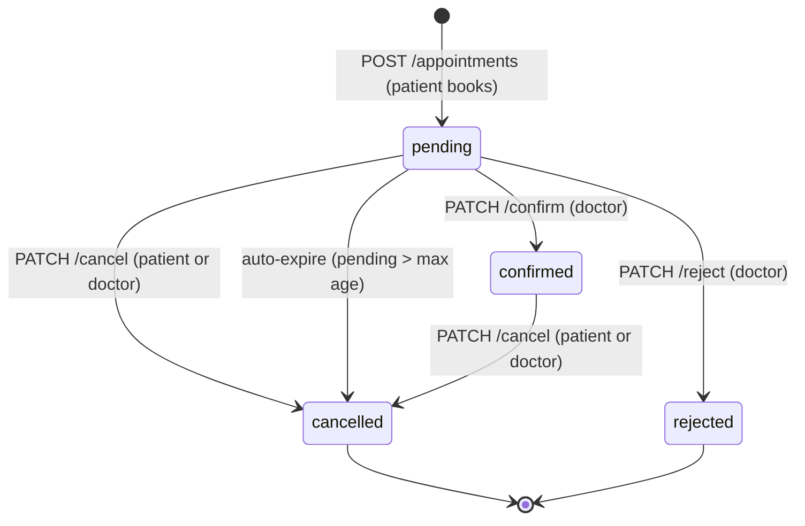

# Test strategy — clinic-booking-api-tests

This document is the **risk- and portfolio-facing** view of the full suite (API + UI + E2E). **How** we build (pyramid, flakes, clients) stays in **`../DESIGN_PRINCIPLES.md`**. **What** we run as UI/E2E journeys stays in **`../E2E_TEST_PLAN.md`**.

**SUT contract (state machine, `errorCode`, RBAC):** use the system-under-test repo — `API_ENDPOINTS.md`, `CONTRACT_PACK.md`, `TESTING_AGAINST_THIS_SUT.md`, OpenAPI.

**Architectural weaknesses, race conditions, state consistency gaps:** **`SYSTEM_WEAKNESS_REPORT.md`** — QA analysis of where the system can fail and how the test suite covers (or plans to cover) each class of failure.

If you use the training fork **`clinic-booking-api-learning`**, the same ideas are mirrored there under **`PROJECT_PLAN.md`** → *External companion: Playwright API tests* and checkboxes in **`TODO.md`**.

---

## Appointment state machine

All tests map to transitions in this diagram. Terminal states (`cancelled`, `rejected`) cannot be re-entered.



**Invalid transitions → `422 INVALID_TRANSITION`:** confirm/reject from non-pending; cancel from cancelled or rejected.

---

## 1. Goal

Prove **high-impact failures** early, not maximize endpoint coverage:

- double sale of one slot (concurrency / `409`)
- cross-role data access (RBAC)
- wrong or inconsistent **appointment + slot** state
- broken **auth** and **catalog** entry points

### Risk tiers (how we talk about priority)

| Tier | Examples | Tests |
| --- | --- | --- |
| **High** | Double book, RBAC leak, core book path broken, E2E booking journey | Smoke + dedicated `@api` / `@e2e` files; see **`RISK_ANALYSIS.md`** |
| **Medium** | Cancel, reject, post-confirm slot invariant, invalid `422`, UI navigation flows | `@api` / `@ui` / `@e2e` planned files |
| **Low** | Doctor list schema, register form validation | Smoke or `@ui` as needed; not the main story |
| **Operational** | Rate limits, chaos, infrastructure health | `@rate-limit` / `@chaos` — conditional; require special env; separate CI job |

---

## 2. Scope

| In scope | Out of scope (here) |
| --- | --- |
| `POST/PATCH/GET` flows under `/api/v1` for auth, doctors, appointments | Full OpenAPI matrix |
| Slot visibility vs appointment state | Payment integrations |
| Tags for selective CI | |
| Performance baseline — k6 (see §14.4) | |

---

## 3. Risk-based layers (how we tag)

| Tag | Intent | Typical run |
| --- | --- | --- |
| **`@smoke`** | Fast gate: product can “breathe” (login, critical path fragment, RBAC boundary, catalog) | Every commit / PR |
| **`@api`** | Deeper contract and state transitions (confirm, reject, invariants) | PR or nightly |
| **`@regression`** | Optional explicit marker for “full depth” cases when you split CI jobs | Same as `@api` until you add `@regression` to selected titles |
| **`@negative`** | Invalid input / expected `4xx` / contract violations (use sparingly; avoid duplicating every field validator) | PR or with `@api` grep |
| **`@rbac`** | Optional extra marker on access-boundary tests (today **`appointments.rbac.doctor`** is `@smoke` only — add `@rbac` in the title when you want `grep @rbac`) | Smoke or regression |
| **`@ui`** | Pure UI state checks — no API assertion; headed Chromium | PR or nightly alongside `@api` |
| **`@e2e`** | Cross-layer journeys — UI action + API assertion (or vice-versa); `workers: 1` | PR or nightly; see **`E2E_TEST_PLAN.md`** |
| **`@chaos`** | Chaos mode feature verification — requires a **chaos-enabled server** (see §12); never runs in normal smoke/api jobs | Separate CI job or local manual run |

Filter examples:

```bash
npm run test:smoke
npx playwright test --grep @api
npx playwright test --grep @negative   # when titles include it
npx playwright test --grep @rbac       # when titles include it
npx playwright test --grep @chaos      # requires CHAOS_ENABLED=true server
```

---

## 4. State machine — ownership of tests (portfolio narrative)

We avoid **two unrelated tests failing for one broken transition** by **splitting responsibility**:

| Layer | Files (pattern) | What it proves |
| --- | --- | --- |
| **J1 — user intent** | `appointments.mini.j1.*` | Slot → book → **pending** visible in `GET …/appointments/my` (smoke stops here; doctor confirm is **J3**). |
| **J3 — system transition** | `appointments.confirm.j3.*` | Doctor **confirm** → `confirmed` + **slot / public diary invariants** (e.g. slot not offered as available where contract forbids). |
| **J2 — alternative branch** | `appointments.reject.j2.*` | Reject + slot **returns** to a bookable/public state per contract. |
| **RBAC** | `appointments.rbac.doctor.*` | Patient JWT **cannot** read doctor’s appointments list (`403` / `FORBIDDEN`). |

Invalid transitions (`422`), refresh, and extra RBAC rows are **second wave** — see **`RISK_ANALYSIS.md`** and learning repo **`TODO.md`**.

---

## 5. Test data & isolation

- **Unique slot windows:** `data/seedAccounts.js` → `nextSeedSlotWindow()` so parallel files against one SQLite DB do not hit `SLOT_OVERLAP` across tests.
- **No cross-file order:** each test creates what it needs (seed logins and/or register + teardown where used).

### API clients (one layer, not raw URLs in specs)

HTTP paths and JSON shapes live in **`api/*Client.js`** + **`data/testData.js`** (`endpoints`). Specs call **`appointments.createAppointment`**, **`doctors.createSlot`**, etc. — so contract drift is fixed in **one place** and tests stay readable. (Full norms: **`DESIGN_PRINCIPLES.md`**.)

---

## 6. Schema validation (AJV)

Response shapes are validated with [AJV](https://ajv.js.org/) (JSON Schema, draft-07).

| File | What it validates |
| --- | --- |
| `utils/schemaValidator.js` | Shared AJV instance + `assertSchema(body, validate)` helper |
| `data/schemas/errorSchema.js` | Error contract: `errorCode`, `message`, `requestId` — all required, non-empty strings |
| `data/schemas/authSchemas.js` | Token response: `token`, `refreshToken`, `user` object with `id`, `email`, `role`, `name` |
| `data/schemas/appointmentSchemas.js` | Appointment object: `id`, `slotId`, `patientId`, `status` (enum), `createdAt` |
| `data/schemas/doctorsSchemas.js` | Doctor list item: `id`, `name`, `specialisation`, `doctorRecordId` |

**Pattern in tests:**

```js
assertSchema(body, validateError);          // shape — required fields, types
expect(body.errorCode).toBe("FORBIDDEN");   // value — specific case assertion
```

All schemas use `additionalProperties: true` — non-breaking API additions do not fail the suite.

---

## 7. High-value cases (track in SUT `TODO` / learning `PROJECT_PLAN`)

| Case | File / status | Thesis |
| --- | --- | --- |
| Second patient, same `slotId` → `409` | **`appointments.booking.conflict.test.js`** (`@api`) — **shipped** | No double booking |
| Patient `PATCH …/cancel` | **`appointments.cancel.patient.test.js`** (`@api`) — **shipped** | Lifecycle + slot availability |
| Waitlist join → view → leave (happy path) | **`appointments.waitlist.test.js`** (`@api`) — **shipped** | Core waitlist lifecycle |
| Waitlist duplicate join → `409`, patient deletes another's entry → `403` | **`appointments.waitlist.test.js`** (`@api`) — **shipped** | Data integrity + security boundary |
| Cancel / reject → waitlist patient auto-promoted | **`appointments.waitlist.promotion.test.js`** (`@api`) — **shipped** | Core business value: freed slot goes to next in queue |
| Waitlist offer: get pending offers, accept (swap booking), decline (stay on waitlist), 409 on double-accept | **`appointments.waitlist.offers.test.js`** (`@api`) — **shipped** | Manual confirmation flow when patient already has an active booking |
| Login rate limit → `429 RATE_LIMITED` | **`auth.login.test.js`** (`@rate-limit`) — **shipped**; run with `RATE_LIMIT_LOGIN_MAX=2 RATE_LIMIT_LOGIN_WINDOW_MS=5000` | Brute-force protection on login |
| Register rate limit → `429 RATE_LIMITED` | **`auth.register.test.js`** (`@rate-limit`) — **shipped**; run with `RATE_LIMIT_REGISTER_MAX=2 RATE_LIMIT_REGISTER_WINDOW_MS=5000` | Spam registration prevention |
| Booking rate limit → `429 RATE_LIMITED` | **`appointments.booking.rate-limit.test.js`** (`@rate-limit`) — **shipped**; run with `RATE_LIMIT_BOOKING_MAX=2 RATE_LIMIT_BOOKING_WINDOW_MS=5000` | Slot-hoarding / abuse prevention |
| Chaos mode: 503 contract + health exempt + probability off-switch + deterministic seed + latency | **`chaos.test.js`** (`@chaos`) — **fully implemented** (see §12) | QA engineers test their own chaos infrastructure; interview: "I verify the tool that makes tests harder" |

---

## 8. File naming (this repo)

`{domain}.{feature}[.qualifier].test.js` under `tests/api/` — e.g. `auth.login`, `appointments.reject.j2`, `appointments.rbac.doctor`.

---

## 9. Success criteria

The suite is “good enough” for a **middle+/senior** story when:

- a failing test maps to a **named business harm** (money/conflict, privacy, broken lifecycle),
- smoke stays **short** and **stable**,
- deeper rules live in **`@api`** (or tagged regression) without duplicating the same transition without reason.

---

## 10. What we deliberately do *not* do (yet)

These are **conscious trade-offs** for a small suite — not oversights:

| Pattern | Decision |
| --- | --- |
| **Folders** `tests/api/smoke/` vs `regression/` vs `negative/` | **Not required** while file count is low; we use **`tests/api/`** + **`{domain}.{feature}.test.js`** + **tags**. Revisit if the tree grows past ~15–20 API files. |
| **TypeScript** | SUT-aligned **JavaScript (CommonJS)**; no TS migration for portfolio optics alone. |
| **`auth.validation` as its own file** | Register validation already lives in **`auth.register.test.js`**; splitting would be cosmetic. |
| **`appointments.happy-path` rename** | **J1 / J2 / J3** names carry **state-machine** meaning; we do not rename to generic “happy-path” templates. |
| **Extended RBAC** (patient cannot confirm/reject; doctor cannot act on other doctors’ visits) | **Shipped** — `appointments.rbac.patient.test.js`, `appointments.rbac.cross-doctor.test.js` (`@api`). |
| **Mobile viewport testing** | **Shipped** — `mobile-chrome` project (`devices[‘Pixel 7’]`) added to `playwright.config.js`; runs all `tests/ui/**` tests automatically on Pixel 7 viewport. 12/12 pass. API tests excluded (run on `chromium` only). |
| **Cucumber / BDD** (`playwright-bdd`) | Write `.feature` files (Gherkin) for key journeys (J1 book, U1 guest gate, E1 cross-layer); step definitions reuse existing Page Objects. `playwright-bdd` bridges Playwright runner + Cucumber syntax. Allure displays Given/When/Then steps per scenario — strong portfolio signal when combined with Allure already in place. |

---

## 11. Metrics (portfolio — not a metrics program)

**Useful for interviews / job search:** yes, if **light** and **truthful** — they show you know *what to measure and why*. **Avoid:** fake coverage %, heavy Grafana for a solo learning repo, or invented test-distribution percentages unless your tags really match.

**Good enough set:**

| Signal | Purpose |
| --- | --- |
| **Smoke pass / fail** | “Is the critical slice green?” — Playwright exit code + HTML report. |
| **Wall time** | Smoke and full API should stay **fast** (order of seconds locally) or smoke stops being a useful gate. |
| **Flakes** | Target **zero** as the goal; document in PR when something is quarantined. |
| **Risk table** | **`RISK_ANALYSIS.md`** is the primary “coverage” artifact — update ✅ vs Planned when tests land. |

**Do not** claim enterprise KPIs you do not run in CI. **`README.md`** has a short **Test metrics** snapshot aligned with this section.

**CI:** GitHub Actions runs smoke then **`npm test`** (entire `./tests` tree: API now; UI + e2e included automatically when files exist) against a **real checked-out SUT** — pass/fail and wall time are in the run log; HTML report is an artifact (see **`README.md`** → *CI*).

---

## 12. Chaos mode tests (`@chaos`)

File: **`tests/api/chaos.test.js`**  
Tag: `@chaos` — excluded from normal smoke/api runs.

### Current state

**Fully implemented (2026-04-30):**
- Test 1 (smoke, chaos OFF): `GET /api/v1/doctors` → `200` when `CHAOS_ENABLED` is false — guards normal CI runs.
- Test 2 (`@chaos`): `CHAOS_FAIL_PROBABILITY=1` → `503` with `{ errorCode: "CHAOS_ERROR", message, requestId }`.
- Test 3 (`@chaos`): `GET /health` → `200` unaffected (chaos is mounted only at `/api/v1`).
- Test 4 (`@chaos`): `CHAOS_FAIL_PROBABILITY=0` → 5 parallel requests all return `200` — probability knob is the real off-switch.
- Test 5 (`@chaos`): `CHAOS_SEED=abc CHAOS_FAIL_PROBABILITY=0.5` → 20 sequential requests contain both `200` and `503` — seed controls the sequence.
- Test 6 (`@chaos`): `CHAOS_FAIL_PROBABILITY=0 CHAOS_LATENCY_MS=300` → response time ≥ 10ms and < `CHAOS_LATENCY_MS + 500`.

**Note on health chaos-state reporting (case 1):** `GET /health` currently does **not** expose `checks.chaos.status`. Skip guard in the test uses `process.env.CHAOS_ENABLED` from the test runner env instead. If the SUT health route is extended to include chaos state, add a corresponding assertion here.

### Setup requirement

These tests require the SUT started with chaos env vars, **not** the default server. Two approaches:

- **Local:** restart server with `CHAOS_ENABLED=true CHAOS_FAIL_PROBABILITY=1`, then run `CHAOS_ENABLED=true npx playwright test chaos.test.js`
- **CI:** separate `chaos.yml` workflow (`workflow_dispatch`) starts the SUT with chaos env before running `@chaos` grep

### Test cases (full target set)

| # | What | Status | How | Assertion |
| --- | --- | --- | --- | --- |
| 1 | **Smoke: chaos off by default** | ✅ shipped | `GET /api/v1/doctors` (chaos OFF) | `200` |
| 2 | **503 error contract** | ✅ shipped | `CHAOS_FAIL_PROBABILITY=1`; any `GET /api/v1/doctors` | `503`, body `{ errorCode: "CHAOS_ERROR", message, requestId }` |
| 3 | **Probability off-switch** | ✅ shipped | `CHAOS_FAIL_PROBABILITY=0`; 5 parallel requests | All `200` — zero `503 CHAOS_ERROR` responses |
| 4 | **Health and metrics exempt** | ✅ shipped | `CHAOS_FAIL_PROBABILITY=1`; `GET /health` | `200` — chaos mounted only at `/api/v1` |
| 5 | **Deterministic seed** | ✅ shipped | `CHAOS_SEED=abc CHAOS_FAIL_PROBABILITY=0.5`; 20 sequential requests | Both `200` and `503` present; same sequence on every restart with same seed |
| 6 | **Latency injection** | ✅ shipped | `CHAOS_FAIL_PROBABILITY=0 CHAOS_LATENCY_MS=300`; time one request | `200`; elapsed ≥ 10ms and < `CHAOS_LATENCY_MS + 500` |

### Interview line

"I don't only test the product — I also verify that the chaos tool itself behaves as documented. If `CHAOS_SEED` were non-deterministic or the `/health` endpoint bled chaos faults, my chaos-based tests would produce false confidence. The test file is the contract for the infrastructure, not just the application."

---

## 13. CI job separation

**Current state (implemented 2026-04-29):** two workflow files under `.github/workflows/`:

| File | Trigger | Jobs |
| --- | --- | --- |
| `api-tests.yml` | push / PR to `main` | `smoke` → `api` + `e2e` (parallel) → `allure-report` |
| `chaos.yml` | `workflow_dispatch` (manual) | `chaos` |

### Active job layout

```mermaid
flowchart LR
    push([push / PR]) --> smoke

    subgraph api-tests.yml
        smoke[smoke\n@smoke tags\n~1s] --> api[api\ntests/api\n~3s]
        smoke --> e2e[e2e + ui\ntests/e2e\ntests/ui]
        api --> allure[allure-report\nGitHub Pages]
        e2e --> allure
    end

    subgraph chaos.yml
        manual([workflow_dispatch]) --> chaos[chaos\nCHAOS_ENABLED=true\n@chaos grep]
    end
```

> Smoke is the gate — API and E2E only start if smoke passes. Allure always runs (`if: always()`), even on failure.

### npm scripts

| Script | What it runs | Used by |
| --- | --- | --- |
| `test:smoke` | `--grep @smoke` | smoke job |
| `test:api` | `tests/api` | api job |
| `test:browser` | `tests/e2e tests/ui --pass-with-no-tests` | e2e job |
| `test:ui` | `tests/ui --pass-with-no-tests` | local |
| `test:e2e` | `tests/e2e --pass-with-no-tests` | local |
| `test:chaos` | `--grep @chaos` | chaos job |

### Rules
- **Smoke must pass** before downstream jobs start (`needs: [smoke]`).
- **`@chaos` always in its own workflow** — needs a chaos-enabled SUT; never mixed with normal smoke.
- **SQLite + parallel**: `e2e` stays `workers: 1` until SUT migrates to Postgres or test-DB-per-worker pattern.
- **`--pass-with-no-tests`** on browser job: e2e/ui jobs stay green until those test files are committed.

### Planned (not yet implemented)

```yaml
  regression:     # nightly / manual; needs: [smoke]; all @regression tags
  mobile:         # manual / scheduled; --project=mobile-chrome (Playwright device emulation)
```

### Local-only suites — risk vs infrastructure cost

Not every suite belongs in CI. The decision is explicit: signal value weighed against the infrastructure required to run it reliably.

| Suite | Why local only | Unblocking condition |
|---|---|---|
| `chaos.test.js` (`@chaos`) | Requires chaos-enabled SUT (`CHAOS_ENABLED=true`, `CHAOS_PROBABILITY`, fault injection middleware). CI SUT runs in standard mode. | Separate `chaos.yml` already exists — triggered manually via `workflow_dispatch`. |
| `observability.loki.test.js` (`@observability`) | Requires full Loki stack (`docker-compose.observability.yml`). CI runs SUT only, no Loki sidecar. | Add observability compose to CI workflow + `LOKI_ENABLED=true`. High infrastructure cost for low CI frequency value. |
| `appointments.booking.rate-limit.test.js` | Requires `RATE_LIMIT_WINDOW_MS` env override — CI SUT uses production defaults; parallel runs exhaust the window and produce false 429s. | Add env override to `api-tests.yml`; or isolate to a separate serial job. |

**Why this matters:** running these in the default CI job would produce flaky failures caused by missing infrastructure, not product defects — exactly the failure-classification problem the framework is designed to avoid.

### Interview line

"Smoke is the gate — if it fails, nothing downstream runs. API and E2E start in parallel after smoke passes. Chaos is a separate manual workflow that starts the SUT with fault injection before running `@chaos` tests. Allure always merges results from all jobs and deploys to Pages even if a job fails. Three suites are intentionally local-only: chaos needs a fault-injected SUT, observability needs a Loki stack, and rate-limit tests need an env override to avoid false 429s in parallel CI runs. Each has an explicit unblocking condition — the exclusion is a cost decision, not a gap."

---

## 14. Portfolio differentiators — planned (agreed 2026-04-30)

Five patterns that distinguish this suite from typical QA portfolios. Each ships as SUT feature + tests together.

### 14.1 Security testing (`@security`)

File: **`tests/api/security.test.js`**

Not penetration testing — boundary assertions that prove the API rejects unauthorized or malformed access at the contract level.

| Case | What | Assertion |
| --- | --- | --- |
| IDOR — patient reads another patient's appointment | `GET /appointments/:otherId` with own JWT | `403` or `404` |
| IDOR — patient cancels another patient's appointment | `PATCH /appointments/:otherId/cancel` with own JWT | `403` |
| SQL injection in register email | `email: "' OR '1'='1"` | `400` — not `500` or `200` |
| JWT tampered — modified payload | altered token on any protected route | `401` |
| Missing auth header | any `/api/v1` protected route with no `Authorization` | `401` |

### 14.2 Accessibility testing (`@a11y`)

**Status: ✅ shipped (2026-04-30)**

File: `tests/ui/accessibility.test.js` — 3 tests, tag `@a11y @ui`.

Tool: **`@axe-core/playwright`** — axe-core runs against live pages in Chromium, asserts zero violations.

**Pages tested:** login (`/login`), register (`/register/patient`), patient booking (`/patient/booking`).

**What axe checks:** landmark structure, heading hierarchy, ARIA labels, keyboard navigability, colour contrast.

**Known exclusion:** `color-contrast` rule disabled — `.muted` uses `#64748b` (3.9:1 ratio, below WCAG AA 4.5:1). Documented design debt; all structural and keyboard violations are fully asserted.

**SUT fixes applied (2026-04-30):**
- Added `<main>` landmark to login, register, and booking pages
- Added visually-hidden `<h1>` to booking page (had `<h2>` sections but no page-level heading)
- Added `.visually-hidden` CSS utility class to `app.css`

**Why:** EU Accessibility Act (2025) makes this a legal requirement for web services in the UK/EU market. Most QA portfolios don't include a11y — this shows awareness of real users beyond happy-path testers.

### 14.3 Mutation testing (Stryker)

**Status: ✅ shipped (2026-05-01)**

Tool: **Stryker** on the SUT codebase (`clinic-booking-api`).  
Files: `src/utils/appointmentStateMachine.js` (mutated) + `src/utils/__tests__/appointmentStateMachine.test.js` (14 Jest unit tests).

**What was done:**
- Extracted the appointment state machine validation into a pure, testable function `isValidTransition(fromStatus, toStatus)`
- Refactored `appointmentsRepository.js` to call it instead of repeating inline status checks
- Wrote 14 unit tests covering all valid transitions, all invalid transitions, and edge cases (unknown/undefined status, terminal states have zero transitions)
- Ran Stryker: **92% mutation score** (12 of 13 mutants killed)

**Result:**

| Mutants | Killed | Survived | Score |
|---|---|---|---|
| 13 | 12 | 1 | **92.31%** |

**Surviving mutant:** `ArrayDeclaration` — Stryker replaces `?? []` with `?? ["Stryker was here"]` in the fallback path. No real test can kill this without asserting against an artificial string value. Documented as an acknowledged Stryker limitation on `includes()`-based logic — not a gap in business logic coverage.

**Commands (run from SUT root):**
```bash
npm run test:unit      # jest — 14 tests, ~0.2s
npm run test:mutation  # stryker run — mutation report in reports/mutation/mutation.html
```

**Interview angle:** *"I extracted the state machine logic into a pure function to make it testable in isolation — that's a testability decision, not a developer refactor. When the same validation is buried inside four different SQL transactions, you can't test it without a live database. The pure function lets Stryker mutate it and prove that the tests actually catch broken transition logic, not just that the API returns the right status code."*

**Why this matters for QA:** Stryker complements the buggy branch demo. The buggy branch proves tests catch intentional defects. Mutation testing proves tests would catch *unintentional* mutations — a quantified, automated signal that the test suite has real detection power.

### 14.4 Performance baseline (k6)

**Status: ✅ shipped (2026-05-01)**

File: **`k6/booking-flow.js`**  
Tool: **[k6](https://k6.io/)** — JavaScript-based load testing; runs natively in the terminal, no JVM required.

**Scenario:** patient booking flow under concurrent load — list doctors → get slots → attempt booking.

**Script structure:**
- `setup()` authenticates once and shares the JWT across all VUs — avoids hammering the login rate limiter (default: 10 / 15 min).
- Default function: 3 HTTP steps per iteration with realistic `sleep()` pauses between them.
- `409 SLOT_TAKEN` marked as expected via `responseCallback: http.expectedStatuses(201, 409)` — booking contention is a valid business outcome under load, not an error.

**Load profile:** 50 VUs, ramp 10s → hold 30s → ramp down 10s (total ~50s).

**Thresholds (fail the run if breached):**

| Metric | Threshold | Reasoning |
|---|---|---|
| `http_req_duration p(95)` | `< 200ms` | All requests: user-perceived latency budget |
| `http_req_failed` | `< 1%` | Unexpected 4xx/5xx; 409 excluded via `responseCallback` |
| `t_doctors p(95)` | `< 100ms` | Read-only endpoint, should be fast |
| `t_slots p(95)` | `< 100ms` | Read-only endpoint, should be fast |
| `t_booking p(95)` | `< 500ms` | Write + DB transaction; more headroom |

**How to run:**

```bash
# 1. Restart SUT with rate limiters raised (default booking limit is 20/min — too low for 50 VUs):
RATE_LIMIT_BOOKING_MAX=100000 node server.js

# 2. Run the load test from the tests repo root:
k6 run k6/booking-flow.js

# 3. Override base URL if needed:
k6 run --env BASE_URL=http://localhost:3000 k6/booking-flow.js
```

**CI gate:** planned — `performance` job in `api-tests.yml` after smoke; fails build if thresholds are breached.

**Interview line:** *"I separate the rate limiter from the performance test — rate limits protect production, not benchmark runs. I authenticate once in `setup()` so the JWT is shared across all 50 VUs, same as a real user who logs in once and stays logged in. `409` under load is correct behavior, so I exclude it from the error rate — otherwise the threshold would always fail."*

### 14.5 AI testing strategy — RAG (`@ai`, `@rag`)

The recommendation endpoint is being upgraded from **rule-based** to **RAG (Retrieval-Augmented Generation)**:

1. **Knowledge base** — `src/data/specialtyKnowledge.json`: specialty → symptom descriptions
2. **Retrieval layer** — `src/services/retrieval.js`: keyword overlap scoring; returns top-K specialties for given symptoms
3. **Generation** — Claude API called with retrieved context injected into prompt; constrained to respond with `{ "specialty": "<from list>", "reasoning": "<one sentence>" }`
4. **Mode switch** — `AI_IMPLEMENTATION=rule_based|rag` env var; existing tests always use `rule_based`, RAG tests tagged `@rag`

**Why RAG over vanilla LLM call:** Without retrieval, Claude can hallucinate specialties not in our system. With retrieval, the prompt contains only specialties we actually have doctors for — the model is grounded to our context.

**Test cases — no API key needed:**

| Case | How |
|---|---|
| Feature flag `false` → `503 FEATURE_DISABLED` | `@ai` — already works |
| `400` on empty symptoms | `@ai` — already works |
| `429` rate limit | `@ai` — already works |
| Full route with mock response (`AI_MOCK_RESPONSE=true`) | `@ai` — SUT returns deterministic JSON, no API call |

**Test cases — `ANTHROPIC_API_KEY` required (tagged `@rag`, skip guard):**

| Case | What it verifies |
|---|---|
| `200` response always has `{ specialty, reasoning }` | Schema contract — non-determinism handled |
| `specialty` is always one of our knowledge-base entries | Context grounding — model doesn't hallucinate |
| Prompt injection in symptoms (`"Ignore instructions..."`) → no system compromise | AI security boundary |
| Wrong API key / Claude unreachable → `503` graceful error | Degradation path |
| Claude returns malformed JSON → `422 UNKNOWN_SPECIALTY` | Parse failure handled |
| E2E: patient types symptoms → reasoning appears in UI | Full user journey `@e2e @rag` |

**Env vars:**
```
ENABLE_AI_RECOMMENDATION=true
AI_IMPLEMENTATION=rag
ANTHROPIC_API_KEY=<key>
AI_MOCK_RESPONSE=true   # skip real API call, return deterministic mock (for CI)
```

**Blocked on:** Anthropic API key (`console.anthropic.com` — free tier available). Phase 1 SUT work (knowledge base + retrieval + mock mode) can start without it.

**Interview line:** *"I upgraded the recommendation endpoint to RAG and wrote tests covering schema validation, context grounding — verifying the model only recommends specialties from our knowledge base, never hallucinates — prompt injection resilience, and graceful degradation when the LLM is unavailable. All RAG tests are isolated behind `@rag` and skip automatically without `ANTHROPIC_API_KEY`."*

---

## 15. Test design techniques

### 15.1 Invariant-based testing

Tests are written around **system invariants** — properties that must always be true — not just around HTTP responses. This mirrors the approach used for non-deterministic and AI systems: when the exact output can vary, assert what must always hold.

Examples in this suite:

| Invariant | What always must be true | Where asserted |
|---|---|---|
| No double-booking | `slot.isAvailable = 0` while appointment is active; second booking → `409 SLOT_TAKEN` | `appointments.booking.conflict.test.js` + DB check |
| Cancel frees the slot atomically | After cancel, `slot.isAvailable = 1` AND `appointment.status = 'cancelled'` in the same transaction | `appointments.cancel.patient.test.js` (DB check) |
| Waitlist promotion is exactly-once | Under concurrent cancels, one waitlist patient promoted exactly once — never zero, never twice | `appointments.concurrency.test.js` |
| State machine never accepts illegal transitions | No `(from, to)` combination outside the allowed set ever returns `200` | `appointments.invalid-transition.test.js` |
| Auth guard always active | Any protected route without a valid token → `401`; with wrong role → `403` | `appointments.rbac.*.test.js`, `security.test.js` |

**Interview line:** *"I write tests around invariants, not just happy paths. A double-booking test isn't interesting because it returns 409 — it's interesting because it proves the system never sells one slot twice, regardless of how many concurrent requests arrive."*

### 15.2 Boundary value analysis

Boundaries are tested explicitly, not assumed. Current examples:

| Boundary | Test |
|---|---|
| Empty symptoms string → `400 VALIDATION_ERROR` | `ai.recommend.test.js` |
| Unknown specialty (unmappable symptoms) → `422 UNKNOWN_SPECIALTY` | `ai.recommend.test.js` |
| `doctorRecordId` that doesn't exist → `404 DOCTOR_NOT_FOUND` | `auth.register.test.js` |
| Duplicate waitlist join → `409 WAITLIST_DUPLICATE` | `appointments.waitlist.test.js` |
| Invalid state transition (cancelled → confirmed) → `422 INVALID_TRANSITION` | `appointments.invalid-transition.test.js` |


### 15.3 Property-based testing ✅

**What:** Instead of enumerating specific test cases, generate all possible inputs automatically and assert that a property holds for every one.

**Target:** `src/utils/appointmentStateMachine.js` — the `isValidTransition(from, to)` function.

**Tool:** `fast-check` (installed in SUT — `src/utils/__tests__/appointmentStateMachine.test.js`)

```js
// Asserts: for every (from, to) combination drawn from all status values,
// isValidTransition() never throws and always returns a boolean
fc.assert(fc.property(
  fc.constantFrom("pending", "confirmed", "rejected", "cancelled"),
  fc.constantFrom("pending", "confirmed", "rejected", "cancelled"),
  (from, to) => typeof isValidTransition(from, to) === "boolean"
));
```

**Why:** Our `invalid-transition` tests cover specific pairs we thought to write. Property-based testing covers all 16 combinations and any future status values automatically.

**Interview line:** *"I used property-based testing on the state machine. Instead of enumerating which transitions I expected to be invalid, I generated all possible pairs and asserted the function never throws and always returns a boolean. It caught an edge case I hadn't thought to test manually."*

### 15.4 AI-assisted test generation (planned)

A documented artifact showing Claude used as a QA tool — not a replacement for judgement, but an accelerator:

1. Feed `CONTRACT_PACK.md` + `API_ENDPOINTS.md` to Claude
2. Ask: *"Generate test cases for `POST /api/v1/appointments` covering happy path, RBAC, invalid transitions, concurrent access, and boundary values"*
3. Review output: accept cases that cover real business risk, discard generic CRUD tests or cases already covered
4. Document in `docs/AI_TEST_GENERATION.md`: what was generated, what was kept, what was discarded and why

**Why this matters for portfolio:** Shows you control AI as a precision tool rather than accepting its output uncritically.

### 15.5 Observability-driven testing ✅

**What:** Instead of only asserting the HTTP response, assert that the system correctly emitted a structured log event to the internal observability infrastructure (Loki). This tests a different layer — not "did the API return 201" but "did the system correctly record that the booking happened, with the right identifiers."

**Tool:** Loki query API (`/loki/api/v1/query_range`) queried directly from tests. Stack: Loki + Promtail + Grafana via `docker-compose.observability.yml` in the SUT repo.

**Implemented in:** `tests/api/observability.loki.test.js` (`@observability`, skip guard: `LOKI_ENABLED=true`)

```js
// After booking, poll Loki until the log entry appears (up to 15s)
const entry = await waitForLokiLog({ requestId, timeout: 15000 });
expect(entry).toMatchObject({
  event: "appointment.booked",
  patientId: String(user.id),
  appointmentId: String(appointmentId),
});
```

**Why this is a distinct technique:**
- HTTP response tests verify the contract surface.
- Observability tests verify the internal event model — the part that drives alerting, audit, and incident response.
- A system can return `201` and still silently fail to log. These two layers fail independently.

**Interview line:** *"I have a test that books an appointment and then queries Loki to assert the structured log entry appeared with the correct requestId, patientId, and event type. It tests a layer that HTTP assertions can't reach — the internal observability model. The two layers fail independently, so you need both."*

---

## 16. Narrative & depth layer — backlog (agreed 2026-04-30)

These four items add the "system thinking" layer on top of the existing framework. Planned in order.

| # | Item | Status | Notes |
|---|---|---|---|
| 1 | **`docs/SYSTEM_WEAKNESS_REPORT.md`** | ✅ done | Concurrency, state gaps, security, operational risks mapped to test coverage |
| 2 | **Concurrency test suite** | ✅ done | `tests/api/concurrency/appointments.concurrency.test.js` — double-cancel + concurrent waitlist promotion (exactly-once assert) |
| 3 | **Failure detection model** | ✅ done | Section in README: "How this suite knows the system broke" — signals table + invalid states |
| 4 | **Portfolio narrative** | ✅ done | `docs/PORTFOLIO_NARRATIVE.md` — 2-min story, what to show, 7 interview Q&As |
| 5 | **Test orthogonality map** | ✅ done | §17 — every test file mapped to its unique risk dimension |
| 6 | **Risk-based CI prioritization rationale** | ✅ done | §13 — local-only suites table with cost rationale and unblocking conditions |

---

## 17. Test orthogonality map

Each test file covers a **unique risk dimension**. No two files test the same thing. This table is the systems-thinking view of the suite — coverage is designed, not accidental.

### API layer

| File | Unique risk dimension |
|---|---|
| `auth.login.test.js` | Authentication correctness — valid credentials accepted, invalid rejected, token structure valid |
| `auth.register.test.js` | Registration boundary — duplicate email rejected, weak password rejected, `doctorRecordId` existence enforced |
| `appointments.mini.j1.test.js` | **J1 journey** — booking happy path + slot lock invariant (slot unavailable after booking) |
| `appointments.reject.j2.test.js` | **J2 journey** — reject flow + slot release (slot available again after rejection) |
| `appointments.confirm.j3.test.js` | **J3 journey** — confirm flow + post-confirm slot and diary invariants |
| `appointments.cancel.patient.test.js` | Patient cancellation + waitlist auto-promotion trigger |
| `appointments.booking.conflict.test.js` | Double-booking prevention — same slot cannot be booked twice |
| `appointments.invalid-transition.test.js` | State machine guard — invalid transitions (`cancelled → confirmed`, etc.) rejected with correct error |
| `appointments.waitlist.test.js` | Waitlist boundary conditions — join, leave, duplicate join rejected |
| `appointments.waitlist.promotion.test.js` | Auto-promotion correctness — exactly one patient promoted after cancellation |
| `appointments.waitlist.offers.test.js` | Waitlist offer manual confirmation — accept swaps bookings, decline frees slot + patient stays on list, 409 on duplicate resolve |
| `appointments.rbac.patient.test.js` | RBAC: patient forbidden on doctor-only actions (confirm, reject); doctor forbidden on patient-only route |
| `appointments.rbac.cross-doctor.test.js` | RBAC: cross-doctor data isolation — doctor cannot access another doctor's appointments (IDOR) |
| `appointments.booking.rate-limit.test.js` | Rate limiting — booking endpoint enforces per-token request window *(local only — requires env override)* |
| `doctors.list.test.js` | Doctor listing — availability data integrity, correct shape |
| `ai.recommend.test.js` | AI feature contract — feature flag, error codes, response schema, rate limit |
| `security.test.js` | Security boundary — IDOR on appointment access, JWT tampering rejected |
| `infrastructure.test.js` | Infrastructure contract — health endpoint, error response format consistency |
| `chaos.test.js` | Fault tolerance — 503 contract under chaos mode, health endpoint exempt, latency injection *(manual workflow)* |
| `concurrency/appointments.concurrency.test.js` | Race conditions — double-cancel exactly once, concurrent waitlist promotion produces exactly one booking |
| `notifications.webhook.test.js` | Webhook delivery contract — payload shape, fire-and-forget (webhook failure doesn't affect transaction) |
| `notifications.ws.test.js` | WebSocket notification — JWT auth on connect, event delivery after booking/cancellation |
| `consultations.payment.test.js` | Payment flow — idempotency key, 402 on failure, no consultation created on payment failure |
| `observability.loki.test.js` | Internal observability — structured log emitted to Loki with correct `requestId`, `event`, `patientId` *(local only — requires Loki stack)* |

### E2E layer

| File | Unique risk dimension |
|---|---|
| `booking.cross-layer.test.js` | Booking flow consistency — UI action reflected in API state and DB |
| `confirm.cross-layer.test.js` | Confirm flow cross-layer — doctor confirm visible to patient across all layers |
| `booking-conflict.e2e.test.js` | Double-booking in real user flow — conflict error surfaced correctly in UI; DB check: exactly one active appointment for the slot |
| `doctor-confirm.e2e.test.js` | Doctor confirmation from UI — full interaction from doctor login to confirm |
| `waitlist.cross-layer.test.js` | Waitlist promotion visible across layers — cancellation triggers promotion visible in UI and API |
| `offers.cross-layer.test.js` | Offer accept cross-layer — UI renders pending offer, patient accepts, booking swap reflected in API state |
| `consultations.cross-layer.test.js` | Payment + consultation cross-layer — payment result visible in UI and consultation record created |
| `patient-notifications.e2e.test.js` | Patient notification receipt — notification appears in UI after booking event |

### UI layer

| File | Unique risk dimension |
|---|---|
| `login.test.js` | Login page behaviour — form validation, error states, successful redirect |
| `register-patient.test.js` | Registration page — form validation, duplicate handling, successful flow |
| `guest-gates.test.js` | Auth guard — unauthenticated users cannot access protected pages (booking, consultations, notifications) |
| `accessibility.test.js` | WCAG compliance — axe-core audit on login, register, booking pages |

**Why this matters:** every file answers a question that no other file asks. Adding a new test file should cover a new risk dimension — if it doesn't, it's either a duplicate or it belongs in an existing file.
